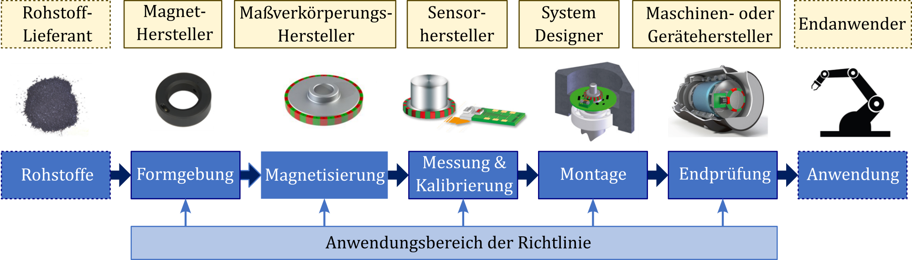

# Einleitung

## Hintergrund und Zielsetzung

**Magnetische Weg- und Winkelmesssysteme** erfassen die Relativposition zweier Bauteile entlang einer festgelegten Bewegungskoordinate. Bei Wegmesssystemen wird diese als Weg entlang eines Pfads, bei Winkelmesssystemen als Drehwinkel um eine mechanische Achse angegeben. Sie machen einen großen Teil der magnetischen Positionsmesssysteme in industriellen Anwendungen aus.

Typischerweise bestehen magnetische Weg- und Winkelmesssysteme aus einem felderzeugenden Dauermagneten – der **magnetischen Maßverkörperung** – und einem **magnetischen Sensor**. Der Sensor erfasst das von der Maßverkörperung erzeugte Magnetfeld und wandelt die darin enthaltene Positionsinformation in elektrische Ausgangssignale um. Aus diesen Signalen wird die relative Position zwischen Sensor und Maßverkörperung bestimmt.

::: {.callout-note}
## Hinweis

*Der Begriff **Sensor** wird in der Praxis uneinheitlich für Sensorelemente als Wandlerelemente und für Sensormodule als funktionale Gesamteinheiten verwendet. In dieser Richtlinie wird er eingesetzt, wenn eine genaue Unterscheidung nicht erforderlich ist.*
:::

Das berührungslose magnetische Messprinzip bietet **Vorteile** hinsichtlich Robustheit, Verschleißfreiheit, Verschmutzungsunempfindlichkeit, Integrationsfähigkeit und Kosten und hat sich daher in zahlreichen industriellen Anwendungen etabliert. [@cassing2018dauermagnete; @michalowsky2006magnettechnik; @schwegler2016permanentmagnete; @hilzinger2013magnetic; @coey2010magnetism; @cullity2008introduction]

Zur **Herstellung** magnetischer Maßverkörperungen werden Rohlinge in einem Magnetisierungsprozess magnetisch codiert. Die Auswahl von Material und Geometrie der Rohlinge richtet sich nach den Anforderungen der späteren Anwendung sowie nach der Komplexität der erforderlichen magnetischen Codierung. Diese reicht von einfachen homogenen Magnetisierungen bis hin zu komplexen Mustern. Materialinhomogenitäten sowie mechanische Toleranzen bei Formgebung, Magnetisierung und Montage zählen dabei zu den **qualitätsrelevanten Fehlerquellen** [@schliesch2022injection] und können die Güte des gesamten Messsystems in der Endanwendung maßgeblich beeinflussen [@kolb2019sensorik].

Herstellung und Prüfung magnetischer Maßverkörperungen bilden einen wesentlichen Abschnitt der Wertschöpfungskette „Vom Rohstoff bis zur Anwendung“, die in @fig-ch01-value_chain dargestellt ist.

{#fig-ch01-value_chain width=100%}

Da die einzelnen Prozessschritte häufig von unterschiedlichen Akteuren durchgeführt werden, entstehen an den Übergängen Schnittstellen hinsichtlich der mechanischen und magnetischen Eigenschaften der Maßverkörperung sowie ihrer Prüfung. Für diese Schnittstellen fehlen bislang eine einheitliche **Terminologie** zur Beschreibung magnetischer Maßverkörperungen, standardisierte **Darstellungsregeln** sowie abgestimmte Verfahren zu ihrer **Vermessung** und **Bewertung**. Eine zuverlässige Qualitätsbewertung setzt insbesondere voraus, dass die verwendeten Prüfverfahren eindeutig beschrieben und vergleichbar angewendet werden können.

Unvollständige Informationen und uneinheitliche Bezeichnungen können an den Schnittstellen zu **Missverständnissen und Fehlern** führen und dadurch zusätzlichen Entwicklungsaufwand und Kosten verursachen. Werden Anforderungen an magnetische Maßverkörperungen nicht eindeutig beschrieben, erschwert dies zudem den Vergleich von Komponenten unterschiedlicher Hersteller sowie die Auswahl geeigneter Alternativprodukte oder Ersatzteile (Second Source).

**Ziel dieser Richtlinie** ist es, eine einheitliche Terminologie sowie Regeln zur Beschreibung, Darstellung, Vermessung und Bewertung magnetischer Maßverkörperungen zu schaffen. Es handelt sich um eine Weiterentwicklung der DIN SPEC 91411 [@DIN91411] und richtet sich an Komponentenlieferanten, Hersteller und Anwender magnetischer Weg- und Winkelmesssysteme.

::: {.callout-note}
## Hinweis

*Diese Richtlinie ist als **lebendes Dokument** angelegt. In der vorliegenden Fassung 1.0 liegt der Schwerpunkt auf Terminologie, Beschreibung, Darstellung, Einteilung und Grundlagen der Vermessung magnetischer Maßverkörperungen. Weiterführende Inhalte, insbesondere zu Prüfaufbau und Bewertung, werden in späteren Fassungen ergänzt.*
:::

## Geltungsbereich

Diese Richtlinie behandelt magnetische Maßverkörperungen als Komponenten magnetischer Weg- und Winkelmesssysteme. Im Mittelpunkt stehen ihre magnetische und geometrische Beschreibung, die Darstellung und Spezifikation ihrer Eigenschaften sowie deren Vermessung und Bewertung.

Die eingeführte Terminologie und Beschreibungssystematik ist speziell für magnetische Weg- und Winkelmesssysteme ausgelegt. Sie kann jedoch in weiten Teilen auch auf mehrdimensionale magnetische Positionsmesssysteme sowie allgemein auf die technische Beschreibung und Darstellung von Dauermagneten übertragen werden.

Das Messsystem, der magnetische Sensor und der Herstellungsprozess der Maßverkörperung werden nur insoweit betrachtet, wie dies für die Beschreibung, Vermessung oder Bewertung der Maßverkörperung erforderlich ist. Die Bewertung des vollständigen Messsystems bzw. der Endanwendung, insbesondere seiner Positionsgenauigkeit, ist nicht Gegenstand dieser Richtlinie.

Die Maßverkörperung wird damit grundsätzlich unabhängig von einem bestimmten Herstellungsverfahren, Sensortyp oder einer konkreten Anwendung beschrieben. Anforderungen an ihre Eigenschaften können sich jedoch aus Herstellung, Sensorik und Anwendung ergeben.