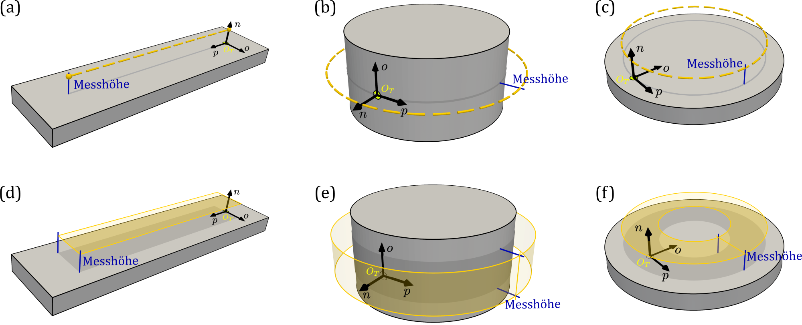

# Streufeld der Maßverkörperung {#sec-05}

Das Streufeld einer Maßverkörperung ergibt sich aus ihrer Polarisation und Geometrie. Im Folgenden werden das Streufeld und charakteristische Feldmerkmale beschrieben, die für die magnetische Vermessung und Bewertung von magnetischen Maßverkörperungen relevant sind.

## Ermittlungsbereich und Feldverläufe {#sec-05-ermittlungsbereich_und_feldverläufe}

Zur Beschreibung und Charakterisierung des Streufeldes wird dieses an räumlichen Lagen relativ zur Maßverkörperung betrachtet. Die Gesamtheit der dabei berücksichtigten Lagen wird als **Ermittlungsbereich** bezeichnet. Ein Ermittlungsbereich kann sich unmittelbar aus der Messaufgabe und der vorgesehenen Relativbewegung nach Kapitel 3 ergeben oder gezielt für die Vermessung und Charakterisierung der Maßverkörperung festgelegt werden. Seine Lage und Orientierung werden im Maßverkörperungs-KS oder in einem zugeordneten Struktur-KS angegeben.

Ein eindimensionaler Ermittlungsbereich wird als **Messpfad** bezeichnet. Verläuft ein Messpfad entlang einer einzelnen Koordinatenrichtung, wird entsprechend von einem **$p$-Pfad**, **$o$-Pfad** oder **$n$-Pfad** gesprochen. Ein $p$-Pfad folgt damit der $p$-Richtung und kann bei zylindrischen Anordnungen gekrümmt verlaufen.

Beispielsweise beschreibt die Parametrisierung $(p,o,n) = (t, 0{,}1\,\mathrm{mm})$ mit $t \in [0\,\mathrm{mm}, 5\,\mathrm{mm}]$ einen geradlinigen, $5\,\mathrm{mm}$ langen $p$-Pfad bei einer Messhöhe von $1\,\mathrm{mm}$. Ein entsprechender Messpfad ist in @fig-ch05-00-ermittlungsbereiche (a) dargestellt.

Ein zweidimensionaler Ermittlungsbereich wird als **Messfläche**, ein dreidimensionaler Ermittlungsbereich als **Messvolumen** bezeichnet. Analog zu Messpfaden können Messflächen anhand der variierten Koordinatenrichtungen bezeichnet werden. Eine $p$-$o$-Messfläche wird beispielsweise durch Variation von $p$ und $o$ bei konstantem $n$ gebildet.

Die Parametrisierung $(p,o,n) = (t,u,1\,\mathrm{mm})$ mit $t \in [0^\circ, 360^\circ]$ und $u \in [-1\,\mathrm{mm}, 1\,\mathrm{mm}]$ beschreibt beispielsweise eine $2\,\mathrm{mm}$ breite $p$-$o$-Messfläche bei einer Messhöhe von $1\,\mathrm{mm}$. Diese Messfläche ist in @fig-ch05-00-ermittlungsbereiche (e) in einer radialen Anordnung und in Teilbild (f) in einer axialen Anordnung dargestellt.

{#fig-ch05-00-ermittlungsbereiche width=100%}

@fig-ch05-00-ermittlungsbereiche zeigt beispielhafte Ermittlungsbereiche für lineare, radiale und axiale Anordnungen. In den Teilbildern (a) bis (c) sind $p$-Pfade bei konstanten $o$ und $n$, in den Teilbildern (d) bis (f) $p$-$o$-Messflächen bei konstanten Messhöhen $n$ dargestellt.

