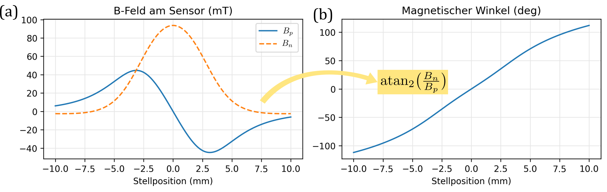

# Beispiele magnetischer Messsysteme {#sec-sec02}

Dieses Kapitel zeigt industrielle Beispiele magnetischer Weg- und Winkelmesssysteme. Die Beispiele verdeutlichen, wie magnetische Maßverkörperungen zusammen mit magnetischen Sensoren zur Positionserfassung in realen Anwendungen eingesetzt werden. Sie dienen als anschauliche Motivation für die in diesem Dokument eingeführten Begriffe, Beschreibungsformen und Modellvorstellungen.

## Wegmesssystem in einer Hinterachslenkung {#sec-sec02-hinterachslenkung}

Die Hinterachslenkung in einem Automobil bezeichnet das zusätzliche Mitlenken der Hinterräder durch gezieltes Verstellen ihres Spurwinkels. Moderne Systeme erreichen dabei je nach Ausführung Spurwinkel von bis zu 10°. Dadurch kann bei niedrigen Geschwindigkeiten der Wendekreis des Fahrzeugs verkleinert und bei höheren Geschwindigkeiten die Fahrstabilität erhöht werden. Eingesetzt wird diese Technologie insbesondere in größeren Pkw, etwa in Limousinen, SUVs, Sportwagen und Elektrofahrzeugen [@haegele2014rearaxle].

Für die Regelung der Hinterachslenkung ist eine robuste und berührungslose Wegerfassung der Aktuatorposition erforderlich. Ein magnetisches Messsystem kann hierfür die Verstellung auch unter fahrzeugtypischen Umgebungsbedingungen wie Vibration, Temperaturänderung, Verschmutzung und begrenztem Bauraum zuverlässig erfassen.

![Beispiel Wegmessung bei einer Hinterachslenkung[^fig-hinterachslenkung-zf]](figures/sec02/01-linearweg_hinterachsenlenkung.png){#fig-sec02-01-linearweg_hinterachsenlenkung width=100% fig-pos="h"}

[^fig-hinterachslenkung-zf]: Quelle: ZF Friedrichshafen AG [@zf2026akc]; redaktionelle Bearbeitung durch die Autoren.

@fig-sec02-01-linearweg_hinterachsenlenkung zeigt ein magnetisches Wegmesssystem, das zur Erfassung des Spurwinkels der Hinterachse eingesetzt wird [@zf2026akc]. Der Spurwinkel wird dabei mechanisch auf einen linearen Stellweg übersetzt. Je nach Ausführung werden Stellwege bis 40 mm durch einen elektromechanischen Aktuator eingestellt.

Zur Positionserfassung, insbesondere zur Erfassung der Neutralstellung, ist an der Spindel ein Aufschraubzapfen montiert. Auf diesem befindet sich ein Schlitten mit einem axial magnetisierten NdFeB-Zylindermagneten, der als einfacher Dipolmagnet die magnetische Maßverkörperung bildet. Der Magnet weist einen Durchmesser von 6 mm und eine Höhe von 3 mm auf. Das blaue Sensormodul mit dem auf der Leiterplatte montierten magnetischen Sensor ist oberhalb des Magneten fest positioniert. Der Abstand zwischen Magnet und Sensor beträgt etwa 3 mm. Bei einer Veränderung des Spurwinkels bewegt sich der Magnet entlang des linearen Stellwegs relativ zum fest montierten Sensor.

{#fig-sec02-02-linearweg_hinterachsenlenkung2 width=100% fig-pos="h"}

@fig-sec02-02-linearweg_hinterachsenlenkung2 (a) zeigt die positionsabhängige Änderung der vom Sensor erfassten Streufeldkomponenten für einen linearen Stellweg von 20 mm in diesem System. Aus den beiden Feldkomponenten wird mit einem üblichen Berechnungsschema ein magnetischer Winkel ermittelt (b). Im betrachteten Stellbereich ist dieser streng monoton und ermöglicht dadurch eine eindeutige Zuordnung der linearen Stellposition zum magnetischen Winkel.

Das Beispiel steht für einfach aufgebaute magnetische Wegmesssysteme, die aufgrund ihrer Robustheit und Kosteneffizienz weit verbreitet sind. Trotz des einfachen Grundprinzips kann die konkrete Einbausituation komplex sein und erfordert eine sorgfältige Systemauslegung sowie eine präzise und robuste Erfassung des Streufeldes.

## Winkelmesssystem in einem Elektromotor {#sec-sec02-emotor}

Die Bestimmung von Drehwinkel und Drehzahl ist eine zentrale Voraussetzung für den geregelten Betrieb elektrischer Motoren. Insbesondere bei geschlossenen Regelkreisen werden diese Größen benötigt, um die Rotorlage zu bestimmen, die Ansteuerung der Phasenströme darauf abzustimmen und Drehmoment sowie Drehzahl präzise zu regeln. Hierfür können unterschiedliche Arten von Drehgebern eingesetzt werden.
 
![Beispiel Winkelmessung in einem Elektromotor[^fig-emotor-sensitec]](figures/sec02/03-emotor_drehgeber.png){#fig-sec02-03-emotor_drehgeber width=100% fig-pos="h"}

[^fig-emotor-sensitec]: Quelle der Abbildung: Sensitec GmbH; redaktionelle Aufbereitung durch die Autoren.

@fig-sec02-03-emotor_drehgeber zeigt eine typische Einbausituation eines magnetischen Drehgebers. Das Messsystem besteht aus einem als Polrad ausgeführten magnetischen Maßstab aus kunststoffgebundenem Hartferrit und einem darauf abgestimmten Sensormodul. Der Maßstab weist zwei magnetische Spuren auf: eine Inkrementalspur mit $N_P=32$ Polen sowie eine Referenzspur mit einem einzelnen Referenzpol. Eine Besonderheit des Maßstabs besteht darin, dass die Referenzspur durch eine kleine, am Spritzgussteil ausgeformte Erhebung („Nase“) realisiert wird, deren Bogenlänge der Pollänge der Referenzspur entspricht.

Das Sensormodul besitzt auf seiner Oberseite einen GMR-Sensor zur Erfassung der Referenzspur und auf seiner Unterseite einen AMR-Sensor zur Erfassung der Inkrementalspur. Es gibt nach interner Signalaufbereitung und Interpolation ein quadraturcodiertes A/B-Signal mit 4096 Flanken pro Umdrehung sowie einen Referenzpuls Z pro Umdrehung aus, siehe @fig-sec02-04-emotor_drehgeber2 (a). Eine typische Fehlerkurve des vollständigen Messsystems ist in Teilbild (b) gezeigt.

![Ausgangssignale und Winkelfehler des magnetischen Drehgebers[^fig-emotor-sensitec]](figures/sec02/04-emotor_drehgeber2.png){#fig-sec02-04-emotor_drehgeber2 width=100% fig-pos="h"}

Das Beispiel veranschaulicht die reale Einbausituation und das Zusammenwirken mehrerer magnetischer Spuren mit unterschiedlichen Funktionen für die Realisierung eines magnetischen Winkelmesssystems.
