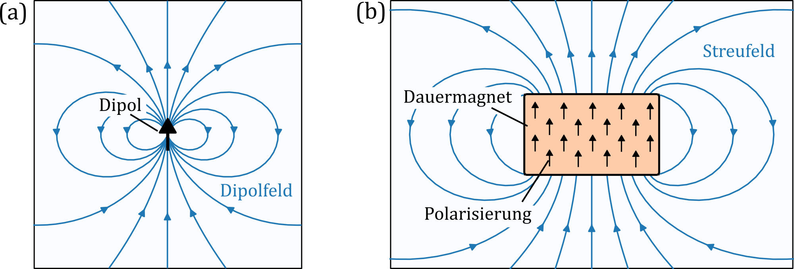
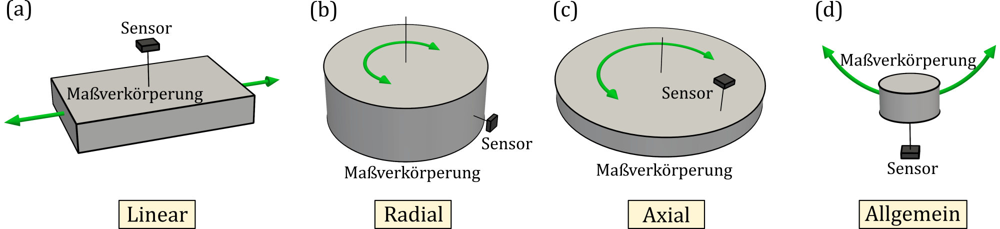
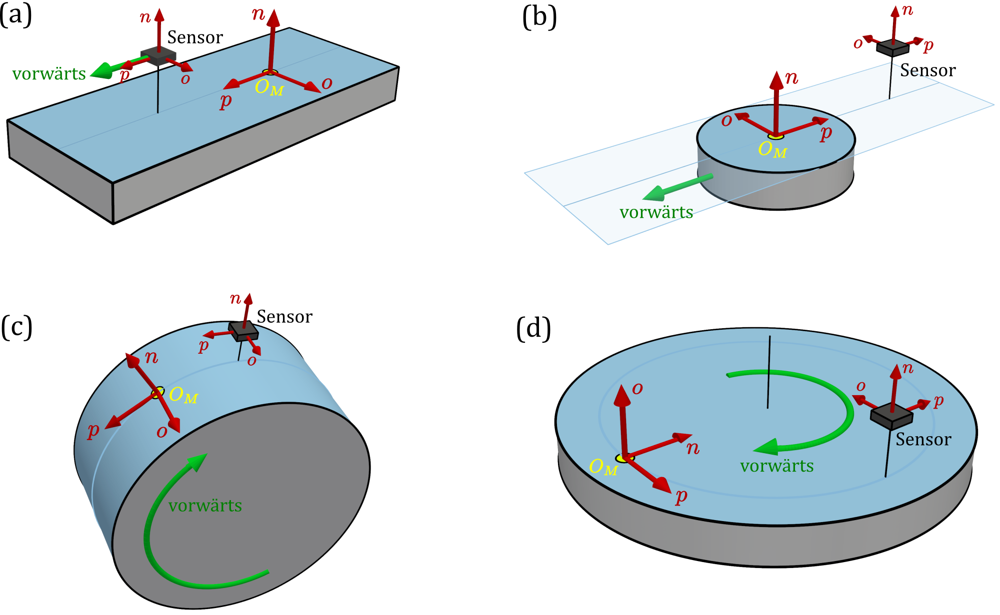

# Grundlagen des Messsystems {#sec-03}

In diesem Kapitel werden wichtige Grundlagen magnetischer Weg- und Winkelmesssysteme beschrieben. Insbesondere werden Komponenten wie Sensor und magnetische Maßverkörperung eingeführt und ihre Anordnung im Messsystem beschrieben.

## Magnet und Magnetfeld {#sec-03-magnet_und_magnetfeld}

Die **Magnetisierung** $\vec{M}$ (Einheit A/m) beschreibt den magnetischen Zustand eines Materials infolge der Ausrichtung seiner mikroskopischen magnetischen Dipolmomente und entspricht dem magnetischen Moment pro Volumeneinheit. Die **magnetische Polarisation** $\vec{J}$ (Einheit T) ist eine dazu proportionale Größe, $\vec{J}=μ_0 \vec{M}$. Ein Körper mit permanenter Magnetisierung wird als **Dauermagnet** bezeichnet [@jackson1998classical; @petrascheck2023elektrodynamik].

::: {.callout-tip}
## Hinweis

*Für den in diesem Dokument bevorzugt verwendeten Begriff **Polarisation** wird in der Fachliteratur und Praxis meist der proportionale Begriff **Magnetisierung** verwendet. Der Begriff Polarisation wird in dieser Richtlinie bevorzugt, weil er eine eindeutige Abgrenzung gegenüber dem Prozess der Magnetisierung sicherstellt. Darüber hinaus entspricht diese Wahl der in der Praxis verbreiteten Angabe der magnetischen Stärke von Dauermagneten in Tesla.*
:::

Das **Magnetfeld** ist ein physikalisches Feld, das von bewegten elektrischen Ladungen oder magnetisierten Körpern erzeugt wird. Es beschreibt den Zustand des Raums, in dem magnetische Kräfte wirken, und wird durch die magnetische Feldstärke $\vec{H}$ und die magnetische Flussdichte $\vec{B}$ charakterisiert. Um den häufig auftretenden terminologischen Verwirrungen vorzubeugen, werden diese fundamentalen physikalischen Größen in diesem Dokument vereinfachend als **B-Feld** und **H-Feld** bezeichnet.

Die Felder $\vec{B}$ und $\vec{H}$ unterscheiden sich durch ihre Einheiten und durch die Berücksichtigung der Magnetisierung. Sie stehen in folgender Beziehung: $\vec{B}=μ_0 (\vec{H}+\vec{M})$. Da im Kontext dieser Richtlinie das Magnetfeld ausschließlich außerhalb einer magnetischen Maßverkörperung betrachtet wird, also in einem Bereich, in dem $\vec{M}=0$ gilt, sind B- und H-Feld proportional und werden daher synonym behandelt. Das Magnetfeld im Außenraum eines Dauermagneten wird auch oft als **Streufeld** bezeichnet.

Die Größen $\vec{M}, \vec{J}, \vec{H}$ und $\vec{B}$ entsprechen den gleichnamigen fundamentalen Feldgrößen aus den Maxwellschen Gleichungen in der Materie [@jackson1998classical; @petrascheck2023elektrodynamik].

Das Magnetfeld eines Körpers ergibt sich aus der Überlagerung der Magnetfelder seiner mikroskopischen Dipolmomente, die seine Polarisation ausmachen. Bei homogener Polarisation weist insbesondere das Streufeld des Körpers eine hohe Ähnlichkeit mit dem Feld eines elementaren Dipols auf und wird im allgemeinen Sprachgebrauch dann häufig vereinfachend als **Dipolfeld** bezeichnet.

{#fig-sec03-01-magnet_und_magnetfeld width=90%}

@fig-sec03-01-magnet_und_magnetfeld (a) zeigt das Feld eines Punktdipols. Teilbild (b) zeigt das Streufeld und die Polarisation eines würfelförmigen Dauermagneten im Querschnitt; die homogene magnetische Polarisation ist durch schwarze Pfeile dargestellt. Die dargestellten Feldlinien basieren auf einer numerischen Simulation. Es wird deutlich, dass das Streufeld eines endlichen Magneten in großem Abstand eine hohe Ähnlichkeit mit dem Dipolfeld aufweist, im Nahbereich jedoch deutliche Abweichungen zeigt.

Dauermagnete können komplexe Polarisation aufweisen. **Dipolmagnete** sind Dauermagnete, deren Magnetfeld im betrachteten Bereich vom Dipolanteil dominiert wird, siehe auch @fig-sec03-01-magnet_und_magnetfeld (b). Typischerweise handelt es sich dabei um Körper mit quasi-homogener Polarisation. **Multipolmagnete** weisen mehrere Polarisationsbereiche auf. Sie können beispielsweise aus mehreren Dipolmagneten zusammengesetzt sein. **Magnetische Maßstäbe** sind hingegen Dauermagnete mit einem typischerweise entlang der Oberfläche verlaufenden streifenförmigen Polarisationsmuster. Diese Einteilung dient vorwiegend der groben Unterscheidung des Komplexitätsgrades eines Dauermagneten und wird in XXXKapitel 7XXX näher ausgeführt.

## Anordnung des Messsystems {#sec-03-anordnung_des_messsystems}

**Magnetische Weg- und Winkelmesssysteme** bestimmen die Relativposition zweier mechanischer Bauteile entlang einer festgelegten Bewegungskoordinate. Sie bestehen im Wesentlichen aus einem Dauermagneten und einem magnetischen Sensor, die jeweils einem der relativ zueinander bewegten Bauteile zugeordnet sind. Der Dauermagnet stellt die für die Positionsbestimmung erforderliche Ortsinformation durch die räumliche Struktur seines Streufeldes bereit und wird in diesem Zusammenhang als **magnetische Maßverkörperung** bezeichnet. Der Sensor erfasst das von der Maßverkörperung erzeugte Magnetfeld.

Ausgehend von der Messaufgabe und den damit verbundenen geometrischen Randbedingungen wird eine geeignete **geometrische Anordnung** von Sensor und Maßverkörperung gewählt. Dabei lassen sich magnetische Weg- und Winkelmesssysteme trotz zahlreicher konstruktiver Realisierungsmöglichkeiten zweckmäßig in vier Gruppen einteilen:

1. **Lineare Anordnung**: Sensor und Maßverkörperung bewegen sich entlang einer geradlinigen Bahn bei unveränderter relativer Orientierung zueinander. Die Bewegung erfolgt meist parallel zu einer Oberfläche der Maßverkörperung. Ein Beispiel hierfür ist die Anwendung nach @sec-sec02-hinterachslenkung.
2. **Radiale Anordnung**: Eine rotationssymmetrische Maßverkörperung rotiert um ihre Rotationsachse. Der Sensor ist seitlich zur Rotationsachse an einer Mantelfläche der Maßverkörperung angeordnet. Ein Beispiel hierfür ist die Anwendung nach @sec-sec02-emotor.
3. **Axiale Anordnung**: Eine rotationssymmetrische Maßverkörperung rotiert um ihre Rotationsachse. Der Sensor ist stirnseitig zur Rotationsachse an einer Stirnfläche der Maßverkörperung angeordnet.
4. **Allgemeine Anordnung**: Geometrische Anordnungen, die keiner der drei zuvor genannten Gruppen zweckmäßig zugeordnet werden.

{#fig-sec03-02-geometrische_anordnung width=100%}

@fig-sec03-02-geometrische_anordnung veranschaulicht die vier geometrischen Anordnungstypen: (a) eine lineare, (b) eine radiale, (c) eine axiale und (d) eine allgemeine Anordnung. Die allgemeine Anordnung ist hier anhand einer typischen eindimensionalen „Joystick-Realisierung“ dargestellt, bei der sich während der Bewegung sowohl die relative Orientierung als auch der Abstand zwischen Maßverkörperung und Sensor verändern.

::: {.callout-tip}
## Hinweis

*Der **Fokus der Richtlinie** liegt auf linearen, radialen und axialen Anordnungen, die einen großen Teil magnetischer Weg- und Winkelmesssysteme abdecken. Die in dieser Richtlinie eingeführte Terminologie ist in weiten Teilen auf allgemeine Anordnungen übertragbar. Die nachfolgend eingeführte Koordinatenwahl ist jedoch insbesondere für lineare, radiale und axiale Anordnungen zweckmäßig.*
:::

## Koordinatensystem der Maßverkörperung {#sec-03-koordinatensystem_der_maßverkörperung}

Aus der geometrischen Anordnung ergibt sich eine **zweckmäßige Koordinatenwahl** zur Beschreibung des Messsystems.

Für die Beschreibung des Messsystems wird eine Bewegungsrichtung des Sensors oder der Maßverkörperung als **Vorwärtsbewegung** festgelegt. Die **p-Richtung** mit dem Richtungsvektor $\vec{e}_p$ zeigt in Richtung der daraus resultierenden relativen Bewegung des Sensors und wird als **Längsrichtung** bezeichnet.

Die **funktionale Oberfläche** der Maßverkörperung ist die dem Sensor zugewandte, für die magnetische Abtastung maßgebende Bezugsfläche. Bei linearen Anordnungen verläuft sie parallel zur Relativbewegung von Sensor und Maßverkörperung; bei radialen und axialen Anordnungen entspricht sie der dem Sensor zugewandten Mantel- beziehungsweise Stirnfläche. Sie kann mit einer physischen Oberfläche der Maßverkörperung zusammenfallen oder als gedachte Bezugsfläche festgelegt werden. Die **n-Richtung** mit dem Richtungsvektor $\vec{e}_n$ steht senkrecht zur funktionalen Oberfläche und zeigt zum Sensor.

Bei linearen, radialen und axialen Anordnungen stehen die Richtungsvektoren $\vec{e}_p$ und $\vec{e}_n$ damit immer senkrecht zueinander. Die **o-Richtung** mit dem Richtungsvektor $\vec{e}_o$ wird als dritte rechtshändige Koordinatenrichtung festgelegt. Sie verläuft parallel zur funktionalen Oberfläche und wird als **Querrichtung** bezeichnet.

Mit einem festgelegten **Ursprung** $O_M$, der auf der funktionalen Oberfläche liegt, bilden die Richtungen $p$, $o$ und $n$ ein rechtshändiges Koordinatensystem (KS), das als **Maßverkörperungs-KS** bezeichnet wird. Es bildet den Bezug für die Beschreibung von Geometrie und magnetischer Struktur der Maßverkörperung, ihres Streufeldes sowie der Positionierung des Sensors.

Die funktionale Oberfläche der Maßverkörperung entspricht dann n=0; die n-Koordinate gibt den Abstand von ihr an und wird als Messhöhe bezeichnet. Die **Messhöhe** des Sensors ist in linearen, radialen und axialen Anwendungen typischerweise konstant.

Bei linearen Anordnungen wird eine kartesische, bei radialen und axialen Anordnungen eine zylindrische Koordinatendarstellung verwendet. In den zylindrischen Fällen beschreibt die p-Koordinate die Winkelposition. Da diese in der Praxis häufig als zugehörige Bogenlänge angegeben wird, ist auf die **verwendeten Einheiten** entsprechend zu achten.

{#fig-sec03-03-koordinatenrichtungen width=90%}

@fig-sec03-03-koordinatenrichtungen zeigt verschiedene Anordnungen von Sensor und Maßverkörperung sowie eine jeweils zweckmäßige Wahl des Maßverkörperungs-KS. Die Teilbilder (a) und (b) zeigen lineare Anordnungen, Teilbild (c) eine radiale und Teilbild (d) eine axiale Anordnung.

Die funktionale Oberfläche der Maßverkörperung ist in der Abbildung blau hervorgehoben. In Teilbild (b) ist sie als gedachte Fortsetzung über die Seitenfläche der Maßverkörperung hinaus dargestellt. Die Vorwärtsbewegung ist grün eingezeichnet. Sie bezieht sich in Teilbild (a) auf die Bewegung des Sensors und in den übrigen Teilbildern auf die Bewegung der Maßverkörperung.

Aus der funktionalen Oberfläche und der Vorwärtsbewegung werden die Koordinatenrichtungen p, o und n wie beschrieben festgelegt. Das daraus resultierende Maßverkörperungs-KS ist rot dargestellt; sein beispielhaft gewählter Ursprung $O_M$ ist gelb markiert. Zusätzlich sind die Koordinatenrichtungen an der jeweiligen Sensorlage eingezeichnet.

::: {.callout-tip}
## Hinweis

*Im allgemeinen Sprachgebrauch wird häufig von **Achsen** anstelle von Koordinatenrichtungen gesprochen. Davon wird hier abgeraten, da bei radialen und axialen Anordnungen einzelne Koordinatenrichtungen ortsabhängig sind und sich ihre Orientierung ändern kann. Der Begriff Achse kann daher fälschlich eine feste Raumrichtung suggerieren.*
:::

## Orientierung magnetischer Größen {#sec-03-orientierung_magnetischer_größen}

Zur Beschreibung der Orientierung magnetischer Größen relativ zur funktionalen Oberfläche werden häufig die Bezeichnungen **in-plane (IP)** und **out-of-plane (OOP)** verwendet. Eine magnetische Größe ist IP-orientiert, wenn sie parallel zur funktionalen Oberfläche liegt, und OOP-orientiert, wenn sie senkrecht dazu steht. Das bedeutet, dass sowohl die $p$- als auch die $o$-Richtung in-plane liegen, während die n-Richtung out-of-plane orientiert ist. Entsprechend sind beispielsweise die Polarisationskomponenten $J_p$ und $J_o$ IP-Komponenten und $J_n$ eine OOP-Komponente.

Bei den in dieser Richtlinie betrachteten linearen, radialen und axialen Anordnungen werden für die Positionsmessung jedoch **überwiegend magnetische Größen in $p$- und $n$-Richtung** genutzt. Die $o$-Komponente der Polarisation beziehungsweise des Magnetfeldes spielt für die betrachteten Messprinzipien in der Regel keine unmittelbare Rolle. Die Bezeichnung IP wird daher in dieser Richtlinie überwiegend für in $p$-Richtung orientierte Polarisationen beziehungsweise für die $p$-Komponente des Magnetfeldes verwendet. Die Bezeichnung OOP bezieht sich entsprechend auf die $n$-Richtung.

## Indexkonventionen {#sec-03-indexkonvention}

Viele der in diesem Dokument verwendeten Größen beziehen sich auf bestimmte Elemente magnetischer Messsysteme oder auf charakteristische Merkmale des Magnetfeldes. Zur Kennzeichnung dieses Bezugs werden die Kürzel in @tbl-bezugsindizes als untere Bezugsindizes verwendet.

| Kürzel | Bezug             | Kürzel | Bezug        |
|:------:|:------------------|:------:|:-------------|
| **M**  | Maßverkörperung   | **F**  | Feld         |
| **S**  | Sensor            | **P**  | Pol          |
| **T**  | Struktur / Spur   | **N**  | Nullstelle   |
| **Z**  | Zone              | **A**  | Peak (apex)  |
|        |                   | **G**  | Grenzwert    |

: Kürzel für Bezugsindizes {.zebra #tbl-bezugsindizes}

Darüber hinaus werden **Ordnungsindizes** verwendet, um einzelne Objekte oder Merkmale zu nummerieren und eindeutig zu kennzeichnen. Sie werden als obere Indizes in runden Klammern geführt.

Der Ordnungsindex $i$ wird für Spuren und Spurfelder verwendet. Für weitere Struktur- und Feldmerkmale wird der Ordnungsindex $j$ eingesetzt. Gleiche Ordnungsindizes stellen dabei nicht grundsätzlich eine Zuordnung zwischen unterschiedlichen Objekttypen dar. Beispielsweise muss Pol 3 nicht notwendigerweise Zone 3 zugeordnet sein.

Sind zur Beschreibung eines Objekts innerhalb einer Spur mehrere Ordnungsindizes erforderlich, werden diese durch ein Komma getrennt. Der erste Ordnungsindex gibt dabei die Spur an. Beispielsweise bezeichnet $l_P^{(2,5)}$ die Länge von Pol 5 der Spur 2.

Bei Größen, die sich auf zwei Spuren oder Spurfelder beziehen, wird der jeweilige Bezugsindex doppelt geführt. So kennzeichnet „TT“ eine Beziehung zwischen zwei Spuren und „FF“ eine Beziehung zwischen zwei Spurfeldern. Beispielsweise bezeichnet $w_{TT}^{(3,4)}$ den Spurabstand zwischen Spur 3 und Spur 4. Bei gerichteten Größen wie dem Versatz ist die Reihenfolge der Ordnungsindizes zu beachten.

::: {.callout-tip}
## Hinweis

*Zur Verbesserung der Lesbarkeit sollen Ordnungsindizes weggelassen werden, sofern die Zuordnung aus dem Kontext eindeutig hervorgeht. Besitzt ein magnetischer Maßstab beispielsweise nur eine Spur, soll anstelle von $w_T^{(1)}$ die verkürzte Schreibweise $w_T$ verwendet werden.*
:::
