# Magnetische Struktur der Maßverkörperung {#sec-04}

@sec-03 führt die magnetische Maßverkörperung und ein ihr zugeordnetes Koordinatensystem ein. Im Folgenden werden ihre geometrische und magnetische Struktur beschrieben sowie Darstellungsregeln und Begriffe für eine technisch detaillierte Strukturbeschreibung festgelegt.

## Magnetisierte Zonen {#sec-04-magnetisierte_zonen}

Magnetische Maßverkörperungen weisen häufig **periodisch strukturierte** oder aufeinander folgende Bereiche alternierend ausgerichteter Polarisation auf. In solchen Fällen lassen sich klar abgegrenzte Bereiche identifizieren, die voneinander getrennten, jedoch meist identisch oder ähnlich aufgebauten Abschnitten entsprechen, die gemeinsam das Gesamtsystem bilden.

Um diese strukturellen Einheiten präzise beschreiben und individuell referenzieren zu können, wird der Begriff der **magnetisierten Zone** eingeführt. Eine magnetisierte Zone ist ein zusammenhängendes, geometrisch einfaches magnetisiertes Volumen, in dem die magnetische Polarisation in ihrer räumlichen Verteilung bekannt ist und einen endlichen Mittelwert aufweist. Zonen dienen der systematischen Zerlegung der Polarisation einer Maßverkörperung in klar definierte Abschnitte, die einzeln analysiert, nummeriert und im Zuge einer Vermessung oder Modellbildung charakterisiert werden. Die Zerlegung einer Polarisationsverteilung in Zonen entspricht mathematisch einer Diskretisierung.

::: {.callout-tip}
## Hinweis

*Die **magnetisierte Zone** ist begrifflich klar von der **magnetischen Domäne** (Weißsche Bezirke) abzugrenzen. Domänen sind meist kleine Bereiche einheitlicher Polarisation, die infolge mikromagnetischer Wechselwirkungen entstehen, während Zonen im Sinne dieses Dokuments strukturelle Einheiten zur Beschreibung der Polarisationsverteilung darstellen. Eine Übereinstimmung ist im Einzelfall möglich, im Allgemeinen jedoch nicht gegeben.*

:::

Besonders anschaulich wird diese Einteilung, wenn eine Maßverkörperung aus mehreren homogenen Dipolmagneten aufgebaut ist – in diesem Fall entspricht jeder einzelne Dipolmagnet einer eigenen Zone. Ebenso entsteht bei magnetischen Maßstäben, deren Polarisationsmuster durch schrittweises Einschreiben magnetisierter Bereiche erzeugt wird, bei jedem Schreibvorgang eine Zone in der unmittelbaren Umgebung des Schreibkopfes.

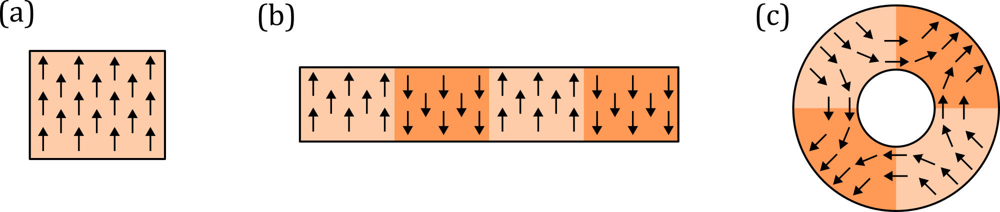{#fig-sec04-01-zone_sketch1 width=90% fig-pos="h"}

In @fig-sec04-01-zone_sketch1 sind Beispiele für typische magnetisierte Strukturen skizziert. Teilbild (a) zeigt einen homogen magnetisierten Dipolmagneten, der eine einzige Zone bildet. Teilbild (b) zeigt einen Multipolmagneten mit alternierender Polarisation entlang der Längsachse. Die unterschiedlich polarisierten Bereiche sind durch Schattierung hervorgehoben und veranschaulichen eine sinnvolle Zoneneinteilung. (c) zeigt einen Quadrupolring mit stark inhomogener Polarisation. Aufgrund seiner periodischen Struktur kann dennoch eine sinnvolle Zoneneinteilung vorgenommen werden.

Die mittlere **Polarisation einer Zone** $\vec{J}_Z$ ergibt sich aus dem Integralmittel des Polarisationsvektorfeldes über das Zonenvolumen. Verläuft $\vec{J}_Z$ in $p$-Richtung, spricht man nach @sec-03-orientierung_magnetischer_groessen von einer IP-Zone; verläuft sie hingegen in $n$-Richtung, von einer OOP-Zone. Eine symmetrische IP-Zone erzeugt demnach mittig über ihrer Oberfläche ein Magnetfeld, das in $p$-Richtung orientiert ist; symmetrische OOP-Zonen ein Magnetfeld in $n$-Richtung.

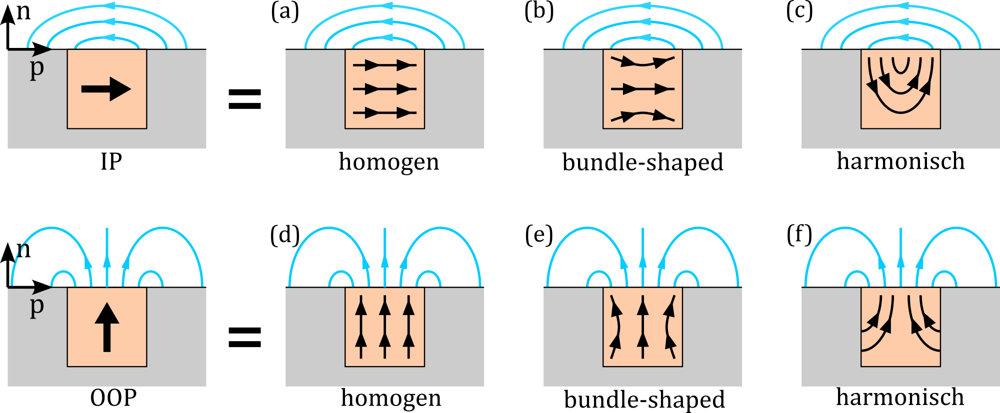{#fig-sec04-02-zone_sketch2 width=90% fig-pos="h"}

@fig-sec04-02-zone_sketch2 zeigt schematische Beispiele für das Magnetfeld (Blau) und die Polarisation (Schwarz) verschiedener symmetrischer IP- und OOP-Zonen (Orange). Teilbilder (a) und (d) zeigen homogene Zonen mit gleichmäßiger Polarisation. In der Praxis tritt jedoch häufig eine „bündelförmige“ (bundle-shaped) Verteilung auf, die beispielsweise durch magnetostatische Selbstwechselwirkungen entsteht, siehe (b) und (e). Wird die Polarisation hingegen mit einem Schreibkopf schrittweise in ein dickes isotropes Material eingeschrieben, entstehen typischerweise harmonisch verlaufende Muster, wie in (c) und (f) skizziert. Die dargestellten Fälle verdeutlichen, dass Zonen auch dann sinnvoll als IP- oder OOP-Zone klassifiziert werden können, wenn die tatsächliche Polarisation nicht homogen ist.

In vielen Fällen ist die **Zoneneinteilung nicht eindeutig**; häufig existieren mehrere plausible Möglichkeiten, eine gegebene Polarisation sinnvoll zu zerlegen. Die gewählte Einteilung sollte daher stets der praktischen Anwendung, dem Verständnis und der eindeutigen Kommunikation dienen. In der Praxis ist dies meist bei einer Zerlegung in IP- oder OOP-Zonen gegeben.

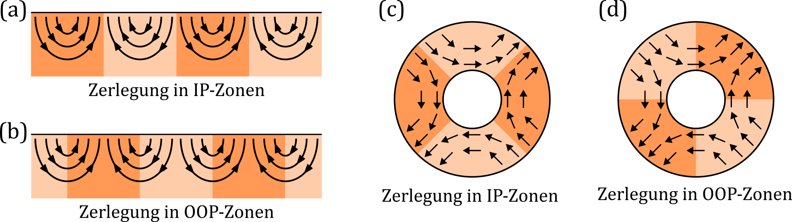{#fig-sec04-03-zone_sketch3 width=90% fig-pos="h"}

In @fig-sec04-03-zone_sketch3 sind Beispiele für verschiedene sinnvolle Zerlegungen derselben Polarisation skizziert. In (a) und (b) wird eine harmonische Polarisation einmal in IP-Zonen und einmal in OOP-Zonen unterteilt. Die Teilbilder (c) und (d) zeigen, dass auch die Polarisation eines Quadrupolrings sinnvoll sowohl in IP-Zonen als auch in OOP-Zonen zerlegt werden kann.

## Magnetpole {#sec-04-magnetpole}

Als **Magnetpol** wird im allgemeinen Sprachgebrauch ein Teilbereich der Oberfläche eines magnetisierten Körpers bezeichnet, an dem das Magnetfeld aus dem Körper austritt oder in ihn eintritt. Bereiche, an denen das Feld austritt, werden als **Nordpole** bezeichnet; Bereiche, an denen es eintritt, als **Südpole**.

Formal wird hierzu die **Normalkomponente** des Magnetfeldes an der Oberfläche des Körpers betrachtet. Ist diese auf der gesamten Oberfläche bekannt, so kann nach dem Eindeutigkeitssatz der Potentialtheorie das Streufeld im quellenfreien Außenraum aus ihr eindeutig bestimmt werden [@jackson1998classical].

Für eine **Poldarstellung** wird die kontinuierliche Normalkomponente auf der Oberfläche durch einen festgelegten Schwellenwert auf die Zustände Nord, Null und Süd reduziert. Das resultierende Polmuster stellt damit eine diskrete Repräsentation der Normalkomponente dar, aus der sich die Streufeldverteilung qualitativ ableiten lässt. Der Nutzen der Poldarstellung liegt in einer anschaulichen qualitativen Beschreibung der Streufeldverteilung eines Körpers.

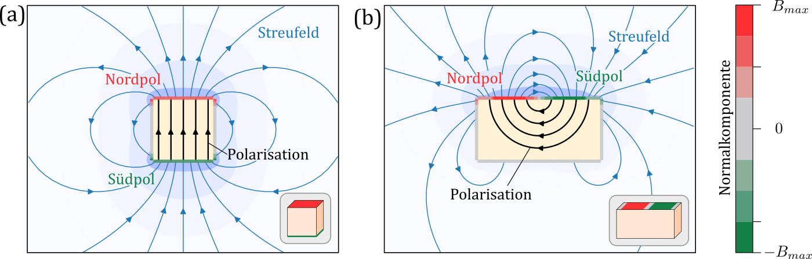{#fig-sec04-04-magnetpole width=100% fig-pos="h"}

In @fig-sec04-04-magnetpole werden das mittels Simulation ermittelte Streufeld und die Normalkomponente zweier Magnete im Querschnitt dargestellt. Die Polarisation der Magnete ist in Schwarz gezeigt. Das Streufeld ist durch Feldlinien sowie durch eine blaue Farbkontur dargestellt. Die Normalkomponente an der Oberfläche der Körper ist in einer rot-grau-grünen Farbskala gezeigt.

In (a) ist ein Würfel mit homogener Polarisation simuliert. An seinen Enden bilden sich die klassischen Polflächen aus. In (b) ist ein Quader mit inhomogener Polarisation simuliert. Die charakteristischen Polflächen bilden sich hier einseitig aus. In beiden Teilbildern ist rechts unten zusätzlich eine repräsentative Nord-Null-Süd-Darstellung der Magnete gezeigt.

Die in diesem Dokument verwendete feldbezogene Poldefinition ist von der **feldtheoretischen Beschreibung** über magnetische Ersatzladungen zu unterscheiden [@cullity2008introduction; @saslow2022magneticpoles]. Bei einfachen Magneten, insbesondere bei homogen und normal zur Oberfläche polarisierten Körpern, stimmen beide Beschreibungen häufig näherungsweise überein. Bei komplexeren Polarisationsverteilungen, beispielsweise bei IP-Zonenanordnungen, ist diese Übereinstimmung im Allgemeinen nicht gegeben. Gleiches gilt, wenn die betrachtete Oberfläche der Maßverkörperung, etwa aufgrund einer Schutzschicht, nicht mit den Oberflächen der magnetisierten Zonen zusammenfällt. Für magnetische Maßverkörperungen ist die feldbezogene Definition besonders zweckmäßig, da sie unmittelbar die anwendungsrelevante Streufeldverteilung beschreibt.

Da feldbezogene Magnetpole aus der Normalkomponente des Streufeldes abgeleitet werden, tragen alle Zonen der Maßverkörperung zu ihrer Ausbildung bei. Pole müssen daher nicht zwingend an den Grenzen einzelner Zonen liegen. Benachbarte **Zonen können Polbereiche verschieben**, verstärken, abschwächen oder sogar auflösen. Ein anschauliches Beispiel sind Halbach-Anordnungen, bei denen benachbarte Zonen so ausgerichtet sind, dass die Polausprägung auf einer Seite der Anordnung verstärkt und auf der gegenüberliegenden Seite abgeschwächt wird.

## Zonenmuster und Polmuster {#sec-04-zonenmuster_und_polmuster}

Die Gesamtheit aller Zonen einer Maßverkörperung wird als **Zonenmuster** bezeichnet. Es stellt eine für Kommunikations- und Referenzierungszwecke geeignete abstrahierte, häufig vereinfachte, Darstellung der Polarisationsstruktur dar. Die Gesamtheit aller Pole einer Maßverkörperung wird als **Polmuster** bezeichnet. Es dient der qualitativen Beschreibung der Streufeldverteilung. Zonenmuster und Polmuster sind **abstrahierte Darstellungen** der magnetischen Struktur zur anschaulichen und zweckmäßigen Kommunikation.

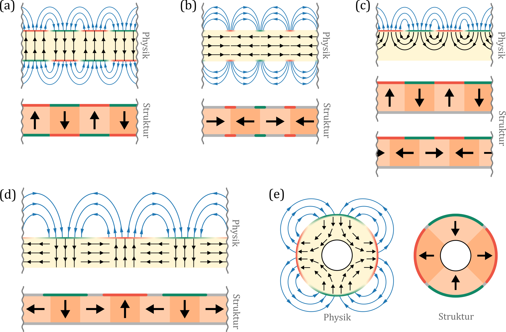{#fig-sec04-05-magnetische_struktur width=100% fig-pos="h"}

@fig-sec04-05-magnetische_struktur zeigt eine Gegenüberstellung zwischen der vollständigen physikalischen Beschreibung (vergleiche mit der Simulation in @fig-sec04-04-magnetpole) und den daraus abgeleiteten Zonen- und Polmustern. Dargestellt sind (a) lineare Anordnung mit OOP-Polarisationsmuster, (b) lineare Anordnung mit IP-Polarisationsmuster, (c) lineare Anordnung mit inhomogener Polarisation, (d) lineare Halbach-Anordnung und (e) ein zylindrischer Quadrupolmagnet. In Unterbild (c) ist die Zerlegung in Zonen nicht eindeutig; daher sind beide Möglichkeiten dargestellt. Die Pole befinden sich jedoch an derselben Stelle.

Polmuster und Zonenmuster sind hier in **Kombination dargestellt**. Während das Zonenmuster die Polarisation anschaulich beschreibt, dient das Polmuster der Veranschaulichung der Streufeldverteilung. Je nach Zweck kann daher die eine oder die andere Darstellung günstiger sein. So kann eine Zonenbeschreibung bei komplexer oder in der Tiefe unbekannter Polarisation schwierig sein, während das Polmuster die wesentliche Feldverteilung dennoch gut vermittelt.

Ein wichtiges Beispiel sind **einseitig ausgeprägte Pole**. Diese können sowohl infolge inhomogener Polarisation wie in (c) und (e), als auch infolge spezieller Anordnungen, wie in (d), entstehen. Das Polmuster macht diese einseitige oder zweiseitige Ausprägung unmittelbar sichtbar, während sie aus dem Zonenmuster häufig nicht direkt ablesbar ist.

Abschließend sei darauf hingewiesen, dass die Polarisation die vollständige magnetische Beschreibung der Maßverkörperung bildet. Aus ihr lassen sich alle anderen Größen ableiten. Umgekehrt lässt sich die zugrunde liegende Polarisation und damit auch das Zonenmuster aus dem bekannten Magnetfeld nicht eindeutig rekonstruieren. Dies ist eine Folge des magnetostatischen inversen Problems [@bruckner2017inverse]. In der Praxis ist die Polarisation jedoch häufig nicht als experimentelle Größe zugänglich.

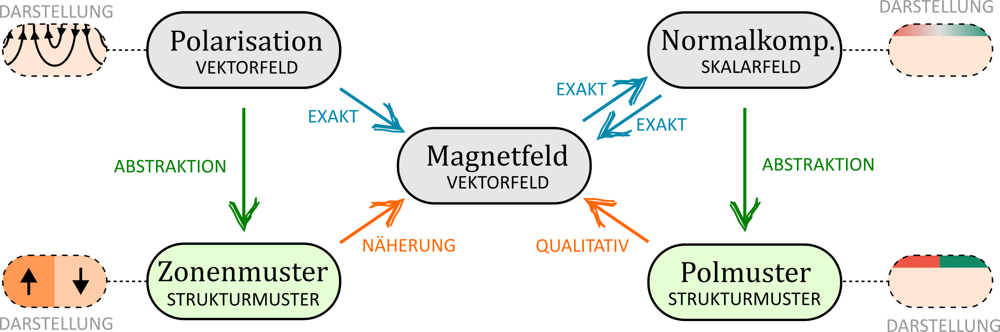{#fig-sec04-06-begriffe_diagramm width=90% fig-pos="h"}

Der Zusammenhang zwischen Polarisation, Magnetfeld, Normalkomponente sowie den daraus abgeleiteten Zonen- und Polmustern ist in @fig-sec04-06-begriffe_diagramm dargestellt. Die Pfeile geben an, welche Größen jeweils aus welchen anderen Größen abgeleitet werden können.

## Magnetische Spuren {#sec-04-magnetische_spuren}

Die magnetische Struktur magnetischer Maßstäbe ist in einem oder mehreren streifenförmigen Bereichen entlang der funktionalen Oberfläche angeordnet. Ein solcher Bereich wird als **magnetische Spur** bezeichnet. Eine Spur erstreckt sich in $p$-Richtung über einen festgelegten Abschnitt der Maßverkörperung und besitzt eine begrenzte Ausdehnung in $o$-Richtung. Ihr sind alle Zonen und Pole zugeordnet, die innerhalb ihres Bereichs liegen. Das von einer Spur erzeugte Magnetfeld wird als **Spurfeld** bezeichnet.

Die **Spurausrichtung** richtet sich nach der geometrischen Anordnung des Messsystems nach @sec-03-anordnung_des_messsystems. Entsprechend werden **Linearspuren**, **Radialspuren** und **Axialspuren** unterschieden. Linearspuren verlaufen geradlinig entlang der funktionalen Oberfläche. Radialspuren liegen an einer Innen- oder Außenmantelfläche einer rotationssymmetrischen Maßverkörperung. Axialspuren liegen an einer Stirnfläche einer rotationssymmetrischen Maßverkörperung. Beispielhafte Ausführungen sind in @fig-sec04-07-spuren_ausrichtung dargestellt.
 
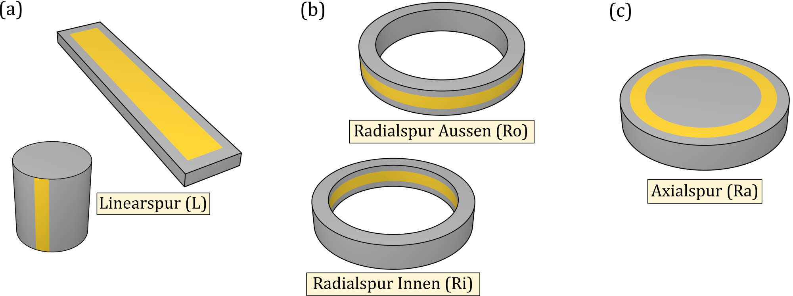{#fig-sec04-07-spuren_ausrichtung width=100% fig-pos="h"}

Der **Beschreibungsgrad** einer Spur kennzeichnet, in welchem Maß sie entlang der $p$-Richtung magnetisch wirksam beschrieben ist. Eine Spur ist **vollbeschrieben**, wenn sie entlang ihrer gesamten Länge magnetische Zonen aufweist. Eine **teilbeschriebene** Spur liegt vor, wenn nur ein begrenzter Abschnitt magnetisch wirksam beschrieben ist. Ein typisches Beispiel hierfür ist eine Spur mit einem Referenzbereich. Eine weitere Ausprägung ist die **segmentiert** beschriebene Spur, bei der mehrere voneinander getrennte, aufeinanderfolgende Bereiche magnetisch wirksam beschrieben sind. Beispielhafte Ausführungen sind in @fig-sec04-08-beschreibungsgrad dargestellt.
 
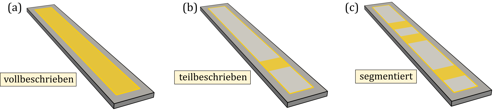{#fig-sec04-08-beschreibungsgrad width=100% fig-pos="h"}

Die **Polarisationsart einer Spur** ergibt sich aus der Polarisationsrichtung ihrer Zonen. Besteht die Spur ausschließlich aus IP-Zonen, spricht man von einer IP-polarisierten Spur oder **IP-Spur**. Ist sie ausschließlich aus OOP-Zonen zusammengesetzt, spricht man von einer OOP-polarisierten Spur oder **OOP-Spur**.

Einen wichtigen Sonderfall stellt dabei die **Halbach-Polarisation** dar. Hier rotiert die Polarisationsrichtung von Zone zu Zone in der $p$-$n$-Ebene. Dadurch entsteht eine asymmetrische Feldverteilung, bei der das Streufeld auf einer bevorzugten Seite der Maßverkörperung verstärkt wird, während es auf der gegenüberliegenden Seite weitgehend unterdrückt ist . Entsprechend spricht man von einer **Halbach-Spur**.

## Darstellungskonventionen {#sec-04-darstellungskonventionen}

Dieses Unterkapitel enthält **Empfehlungen zur Darstellung** von magnetischen Maßverkörperungen. Es wird durch Ausführungen zur Felddarstellung in @sec-05-felddarstellung ergänzt.

Wenn erforderlich, sollte zunächst sichergestellt werden, dass die **geometrische Form** einer Maßverkörperung sowie die ihrer Elemente vollständig erkennbar ist. Hierbei sollten normative Vorgaben, beispielsweise nach ISO 5456, berücksichtigt werden, in denen zulässige Projektionsmethoden geometrischer Körper festgelegt sind.

Für die **Darstellung der Polarisation** (Zonenmuster) sollten benachbarte Zonen eindeutig unterscheidbar sein. Dies kann beispielsweise durch Trennlinien, unterschiedliche Füllfarben oder Schraffuren erreicht werden. Die mittlere Polarisationsrichtung jeder Zone sollte durch Richtungspfeile gekennzeichnet werden. Vorzugsweise wird eine Ansicht gewählt, in der die Richtungspfeile unmittelbar auf den dargestellten Zonenflächen eingetragen und eindeutig räumlich zugeordnet werden können. Dabei kennzeichnen Pfeile Richtungen parallel zur Darstellungsebene und die Symbole ⊙ und ⊗ Richtungen senkrecht zur Darstellungsebene. Kann die Polarisationsrichtung in der gewählten Ansicht so nicht eindeutig vermittelt werden, können ihre Komponenten in einer geeigneten orthogonalen Projektion eingezeichnet werden.

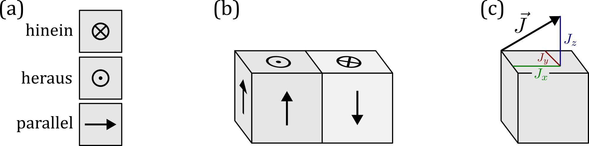{#fig-sec04-09-darstellung_J width=70% fig-pos="h"}

@fig-sec04-09-darstellung_J (a) zeigt die in diesem Dokument verwendeten Pfeilsymbole zur Darstellung der Polarisationsrichtung an Seitenflächen. Teilbild (b) zeigt eine skizzenhafte Maßverkörperung bestehend aus zwei klar abgegrenzten Zonen alternierender Polarisation. Teilbild (c) zeigt eine Zone mit nicht flächenparalleler Polarisation, dargestellt durch Komponenten einer orthogonalen Projektion auf die Deckfläche.

Zur **Darstellung des Magnetfeldes** (Normalkomponente, Polmuster, Felddarstellung) wird der Wert einer ausgewählten Feldkomponente auf einer Bezugsfläche mittels Rot-Grau-Grün-Farbskala visualisiert. In Schwarzweißdarstellungen kann entsprechend eine Weiß-Grau-Schwarz-Skala verwendet werden. Als Bezugsflächen kommen zum Beispiel Zonenseiten, Körperflächen der Maßverkörperung oder Messflächen in Frage. Die Farbskala kann je nach Bedarf kontinuierlich oder diskret ausgeführt werden, wobei binäre und ternäre Ausführungen vor allem für Poldarstellungen und Felddarstellungen nach @sec-05-felddarstellung eingesetzt werden. Besonders bei diskreten Darstellungen sollte die dargestellte Feldkomponente durch zusätzliche Richtungssymbole gekennzeichnet werden. Die dafür verwendeten Symbole unterscheiden sich von den Richtungspfeilen der Polarisation, um Verwechslung zu vermeiden.
 
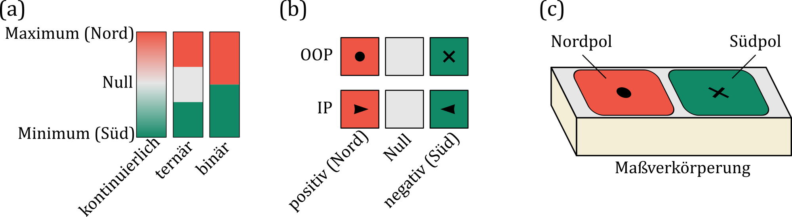{#fig-sec04-10-darstellung_B width=100% fig-pos="h"}

@fig-sec04-10-darstellung_B skizziert die Regeln zur Darstellung des Magnetfeldes. Teilbild (a) zeigt die in diesem Dokument verwendeten Farbskalen in kontinuierlicher und diskreter Form. Die eingesetzten Farbcodes sind #EE5544 für Rot, #E6E6E6 für Grau und #118866 für Grün. Teilbild (b) zeigt die Richtungssymbole zur Kennzeichnung von IP- und OOP-Komponenten des Magnetfeldes. Teilbild (c) zeigt beispielhaft eine Maßverkörperung in Poldarstellung. Dabei ist die auf der Deckfläche ermittelte Normalkomponente mittels dreigeteilter Farbskala dargestellt.

::: {.callout-tip}
## Hinweis

*In wissenschaftlich-technischen Darstellungen wird die Farbkombination Rot–Grün üblicherweise vermieden, da sie für viele Personen mit einer häufig auftretenden Rot-Grün-Sehschwäche nur eingeschränkt unterscheidbar ist [@crameri2020misuse]. In dieser Richtlinie wird diese Farbwahl jedoch aus historischen Gründen beibehalten. Die hier gewählten Farben unterscheiden sich deutlich in Helligkeit und Sättigung, um eine zuverlässige visuelle Unterscheidbarkeit sicherzustellen.*
:::

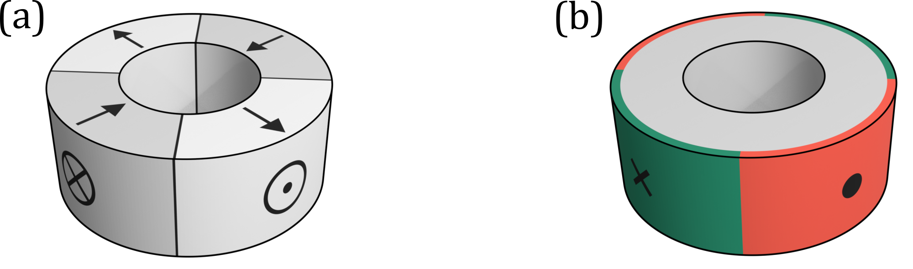{#fig-sec04-11-zonen_und_poldarstellung width=75% fig-pos="h"}

@fig-sec04-11-zonen_und_poldarstellung demonstriert die beiden Darstellungsformen am Beispiel eines Quadrupolrings, wie er typischerweise als magnetische Maßverkörperung in radial angeordneten Winkelmesssystemen mit außen liegenden Sensoren verwendet wird. Die zugehörige inhomogene Polarisation ist in @fig-sec04-01-zone_sketch1 (c) skizziert.

Teilbild (a) zeigt den Quadrupolring in Zonendarstellung. Im Vordergrund steht der strukturelle Aufbau des Magneten, also Anordnung, Form und Zusammensetzung seiner magnetisierten Zonen.

Teilbild (b) zeigt den Quadrupolring in Poldarstellung. Das Polmuster ist auf der Mantelfläche binär dargestellt. Es veranschaulicht das nach außen wirksame Magnetfeld, ohne dabei Information über die innere magnetische Struktur zu enthalten. Zur besseren Anschaulichkeit wurde die Farbcodierung über die sichtbare Kante hinweg auf die angrenzende Deckfläche fortgeführt. Dadurch kann das Polmuster entlang des gesamten Ringumfangs leichter nachvollzogen werden.

Eine **kombinierte Darstellung** von Zonen- und Polmuster ermöglicht es sowohl Polarisationsstruktur als auch Feldwirkung einer Maßverkörperung zu vermitteln. Das ist besonders bei komplexen Anordnungen, bei denen sich die Lage der Pole nicht offensichtlich aus dem Zonenmuster erschließt, hilfreich. Dabei können Pole gegenüber Zonengrenzen verschoben sein, sich über mehrere Zonen erstrecken oder sich einseitig ausprägen.

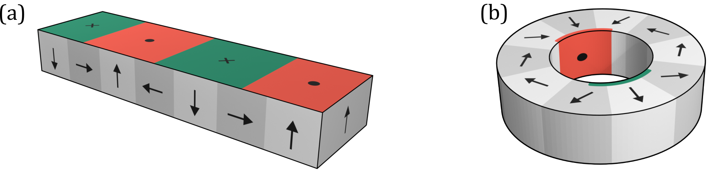{#fig-sec04-12-kombinierte_darstellung width=90% fig-pos="h"}

@fig-sec04-12-kombinierte_darstellung zeigt zwei Beispiele solcher kombinierter Darstellungen. Teilbild (a) zeigt einen Linearmaßstab mit Halbach-Polarisation. Die Pfeile an den Seitenflächen kennzeichnen das Zonenmuster, während das auf der Oberseite binär dargestellte Polmuster die daraus resultierende Feldwirkung veranschaulicht. Teilbild (b) zeigt einen Halbach-Ring. Die Überlagerung von Zonen- und Polmuster macht die Ausrichtung des Magnetfeldes im Inneren des Rings unmittelbar erkennbar.

Eine häufig verwendete kombinierte Darstellungsform ist die **farbcodierte Zonendarstellung**. Dabei werden die Zonen entlang ihrer Polarisationsrichtung mit der kontinuierlichen Magnetfeld-Farbskala eingefärbt. Diese Einfärbung entspricht näherungsweise der Normalkomponente des Magnetfeldes, die eine isoliert betrachtete Zone auf ihren Seiten erzeugen würde, wie in @sec-04-magnetpole ausgeführt. Bei Zusammensetzung der so eingefärbten Zonen ergibt sich in vielen Fällen eine anschauliche Näherung des Polmusters. Voraussetzung ist, dass sich dessen Ausprägung durch die Überlagerung der Feldbeiträge benachbarter Zonen nicht wesentlich verändert.

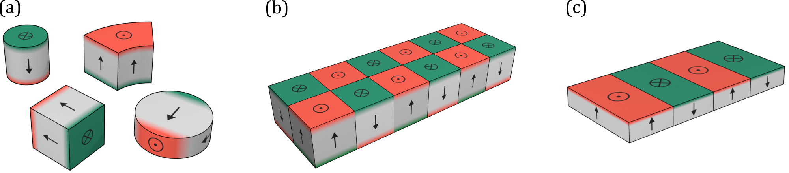{#fig-sec04-13-farbcodierte_zonendarstellung width=100% fig-pos="h"}

@fig-sec04-13-farbcodierte_zonendarstellung demonstriert die farbcodierte Zonendarstellung anhand verschiedener Beispiele. Teilbild (a) zeigt unterschiedliche Dipolmagnete, deren erwartete Feldwirkung durch die Einfärbung der Körperflächen hervorgehoben wird. Teilbild (b) zeigt zweireihig axial gestapelte Würfelmagnete. Die einzelnen Zonen sind klar voneinander abgegrenzt; ihre Einfärbung veranschaulicht das auf Ober- und Unterseite erwartete Polmuster. Teilbild (c) zeigt, wie mit der farbcodierten Zonendarstellung eine einseitige Ausprägung der Pole vermittelt werden kann. Die mögliche zugrunde liegende inhomogene Polarisationsverteilung wird in den @sec-04-magnetisierte_zonen und @sec-04-magnetpole näher beschrieben.

::: {.callout-tip}
## Hinweis

*Weicht das resultierende Polmuster deutlich von der Zonenstruktur ab, wie bei den Beispielen in @fig-sec04-12-kombinierte_darstellung, ist die farbcodierte Zonendarstellung ungeeignet und kann zu **irreführenden Farbzuordnungen** führen.*

*Aufgrund ihrer großen **Ähnlichkeit zur Poldarstellung** besteht zudem eine erhöhte Verwechslungsgefahr. Daher sollte stets eindeutig angegeben werden, welche Darstellungsform verwendet wird.*
:::

Spuren können bei Bedarf durch eine **Umrahmung** und durch die Hervorhebung nichtmagnetisierter Bereiche gekennzeichnet werden. Die Kennzeichnung ermöglicht die eindeutige Zuordnung der zugehörigen Zonen und Pole und verdeutlicht, ob sich eine Spur auch über nichtmagnetisierte Abschnitte erstreckt.
 
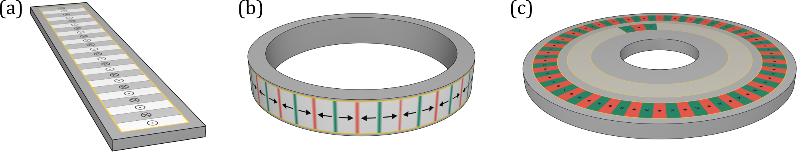{#fig-sec04-14-darstellung_spuren width=100% fig-pos="h"}

@fig-sec04-14-darstellung_spuren zeigt drei exemplarische Darstellungen magnetischer Maßstäbe. Teilbild (a) zeigt einen typischen Linearmaßstab zur Positionserfassung von Linearachsen. Er weist eine inkrementelle OOP-Spur auf, die in reiner Zonendarstellung gezeigt ist. Teilbild (b) zeigt einen Rotationsmaßstab mit einer radial außen liegenden inkrementellen IP-Spur in farbcodierter Zonendarstellung. Derartige Maßverkörperungen werden häufig in Drehgebern eingesetzt. Teilbild (c) zeigt einen Rotationsmaßstab mit zwei axial angeordneten Spuren in Poldarstellung. Die äußere Spur ist eine vollbeschriebene Inkrementalspur. Die innere Spur ist eine teilbeschriebene Spur mit Referenzpolen. Eine solche Kombination wird oft zur absoluten Positionserfassung eingesetzt.

## Magnetische Struktur {#sec-04-magnetische_strukturbeschreibung}

Bisher wurde die magnetische Struktur einer Maßverkörperung anhand von Zonen, Polen und Spuren qualitativ beschrieben. Im Folgenden werden Strukturbegriffe festgelegt, die eine eindeutige geometrische und technisch detaillierte Beschreibung dieser Strukturelemente ermöglichen.

### Struktur-KS und Begrenzungsbox-Geometrie {#sec-04-strukturKS}

Die Beschreibung der magnetischen Struktur erfolgt in einem zweckmäßig gewählten **Struktur-KS** mit Ursprung $O_T$. Seine Koordinatenrichtungen sind in der Regel an den $p$-, $o$- und $n$-Richtungen des Maßverkörperungs-KS ausgerichtet.

Ist das Struktur-KS einer magnetischen Spur zugeordnet, wird es als **Spur-KS** bezeichnet; der Ursprung wird weiterhin mit $O_T$ bezeichnet. Besitzt ein magnetischer Maßstab mehrere Spuren, sollte jeder Spur ein eigenes Spur-KS zugeordnet werden.

Als zweckmäßige **Konvention** wird empfohlen, den Ursprung $O_T$ in $o$-Richtung mittig zur beschriebenen magnetischen Struktur und in $n$-Richtung auf der funktionalen Oberfläche der Maßverkörperung anzuordnen. Die $p$-Lage wird anhand eines eindeutig festgelegten Strukturbezugs gewählt, typischerweise am Beginn der ersten genutzten Zone oder des ersten genutzten Pols. Bei einem Spur-KS wird hierfür vorzugsweise der Beginn der Spur verwendet.

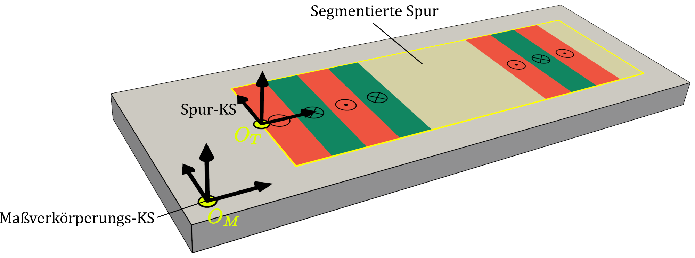{#fig-sec04-15-spurKS width=90% fig-pos="h"}

@fig-sec04-15-spurKS veranschaulicht die Festlegung eines Struktur-KS. Entsprechend der Konvention liegt dessen Ursprung in $o$-Richtung mittig zur magnetischen Struktur, in $p$-Richtung am Beginn der magnetischen Struktur und in $n$-Richtung auf der funktionalen Oberfläche der Maßverkörperung.

Lage und Abmessungen magnetisierter Zonen, von Magnetpolen und magnetischen Spuren können in vielen Fällen näherungsweise durch **Begrenzungsboxkörper** erfasst werden. In kartesischen Koordinaten sind dies achsenparallele Quader, bei zylindrischer Koordinatendarstellung Zylinder- oder Ringsegmente. Angaben in $p$-Richtung können dabei nach @sec-03 als Länge oder Winkel angegeben werden.

::: {.callout-tip}
## Hinweis

*Die nachfolgenden Strukturbegriffe werden verwendet, soweit sich die magnetische Struktur mit der zugrunde liegenden Begrenzungsbox-Geometrie zweckmäßig beschreiben lässt. Für andere Geometrien sind geeignete alternative Größen zu verwenden, wie beispielhaft in @fig-sec04-17-struktur_mp_ring gezeigt.*
:::

### Strukturbegriffe magnetisierter Zonen {#sec-04-strukturbegriffe_zonen}

In Begrenzungsbox-Geometrien werden die Abmessungen magnetisierter Zonen in $p$-Richtung durch die **Zonenlänge** $\ell_Z$, in $o$-Richtung durch die **Zonenbreite** $w_Z$ und in $n$-Richtung durch die **Zonentiefe** $d_Z$ beschrieben.

Zonen werden zu Referenzierungszwecken aufsteigend in positiver $p$-Richtung mit dem Ordnungsindex $j=1,…,N_Z$ nummeriert. Die **Zonenanzahl** $N_Z$ bezeichnet die Gesamtzahl der nummerierten Zonen. Eine vollständige Indizierung aller vorhandenen Zonen ist nicht erforderlich.

Auf eine Zone kann in $p$-Richtung ein Zwischenraum folgen, der keiner Zone zugeordnet ist. Solch ein Zwischenraum entsteht beispielsweise bei aus einzelnen Dipolmagneten zusammengesetzten Maßverkörperungen. Die Ausdehnung des Zwischenraums in $p$-Richtung wird als **Zonenspalt** $\bar{\ell}_Z^{(j)}$ bezeichnet. Er trägt den gleichen Index wie die vorangehende Zone.

Die **Zonenlage** $\vec{r}_Z$ bezeichnet die Position des geometrischen Mittelpunkts des Begrenzungsboxkörpers. Ihre Koordinaten sind $p_Z$, $o_Z$ und $n_Z$.

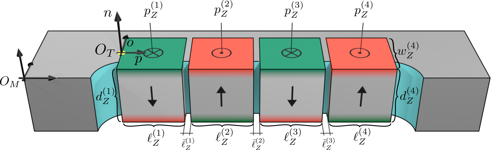{#fig-sec04-16-struktur_mp_quader width=90% fig-pos="h"}

@fig-sec04-16-struktur_mp_quader zeigt eine beispielhafte Strukturbeschreibung einer magnetischen Maßverkörperung mittels Zonen in kartesischen Koordinaten. Die Maßverkörperung besteht aus einer Halterung mit vier eingesetzten würfelförmigen Dipolmagneten, die in einem OOP-Muster angeordnet sind. Die Halterung ist zur besseren Sichtbarkeit teilweise aufgeschnitten dargestellt. Jeder Dipolmagnet wird dabei als eine Zone aufgefasst. Die Zonen sind in positiver $p$-Richtung nummeriert und zugeordnete Größen mit einem entsprechenden Ordnungsindex versehen. Der Ursprung des Struktur-KS $O_T$ liegt entsprechend der Konvention in $o$-Richtung mittig zur Zonenstruktur, in $n$-Richtung auf der funktionalen Oberfläche der Maßverkörperung und in $p$-Richtung am Beginn der ersten Zone.
 
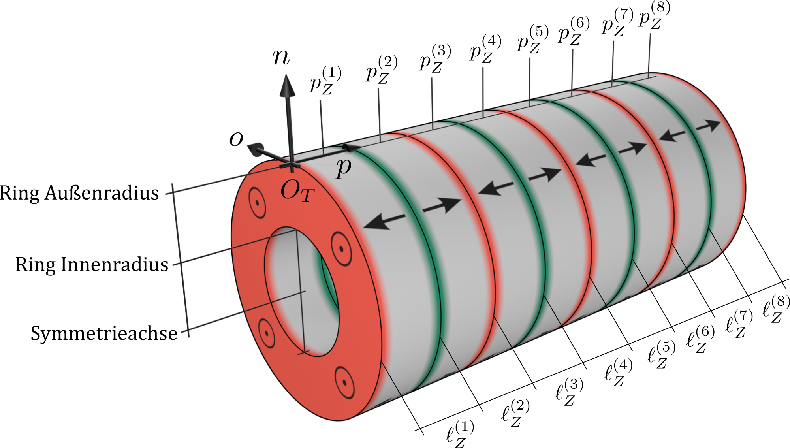{#fig-sec04-17-struktur_mp_ring width=80% fig-pos="h"}

In @fig-sec04-17-struktur_mp_ring ist das Zonenmuster eines axial gestapelten Multipolrings mit $N_Z=8$ dargestellt. Derartige Maßverkörperungen können zur Detektion axialer Verschiebungen entlang der Systemachse eingesetzt werden. Der Ursprung des Struktur-KS ist auf der Mantelfläche in $o$-Richtung mittig und in $p$-Richtung am Beginn der ersten Zone festgelegt.

Obwohl die Maßverkörperung ringförmig ist, handelt es sich dabei um eine lineare Anordnung. In diesem Beispiel ist der Begriff der Zonenlänge sinnvoll anwendbar, da die Zonen entlang der $p$-Richtung gestapelt sind. Die Begriffe Zonenbreite und Zonentiefe sind aufgrund der ringförmigen Geometrie hingegen nicht zweckmäßig. Zur Beschreibung der Geometrie der Maßverkörperung werden stattdessen Innen- und Außenradius des Rings genutzt.

| **Begriff**         | **Symbol**                | **Beschreibung** |
|:----------------|:---------------------:|:-------------|
| **Zonenanzahl** | $N_Z$ | Gesamtzahl der nummerierten Zonen |
| **Zonenlänge**  | $\ell_Z^{(j)}$ | Ausdehnung der Zone $j$ in $p$-Richtung |
| **Zonenbreite** | $w_Z^{(j)}$ | Ausdehnung der Zone $j$ in $o$-Richtung |
| **Zonentiefe**  | $d_Z^{(j)}$ | Ausdehnung der Zone $j$ in $n$-Richtung |
| **Zonenspalt**  | $\bar{\ell}_Z^{(j)}$ | Ausdehnung des einer Zone $j$ folgenden, keiner Zone zugeordneten Zwischenraums in $p$-Richtung |
| **Zonenlage**   | $\vec{r}_Z^{(j)}$ | Position des geometrischen Mittelpunkts des Begrenzungsboxkörpers der Zone $j$; Koordinaten $p_Z^{(j)}$, $o_Z^{(j)}$ und $n_Z^{(j)}$ |

: Begriffe Zonen {#tbl-begriffe_zonen .zebra_blue tbl-colwidths="[25,15,60]"}

### Strukturbegriffe magnetischer Pole {#sec-04-strukturbegriffe_pole}

In Begrenzungsbox-Geometrien werden die Abmessungen von Magnetpolen in $p$-Richtung durch die **Pollänge** $\ell_P$ und in $o$-Richtung durch die **Polbreite** $w_P$ beschrieben.

Pole werden zu Referenzierungszwecken aufsteigend in positiver $p$-Richtung mit dem Ordnungsindex $j = 1, \ldots, N_P$ nummeriert. Die **Polanzahl** $N_P$ bezeichnet die Gesamtzahl der nummerierten Pole. Eine vollständige Indizierung aller vorhandenen Pole ist nicht erforderlich.

Die **Pollage** $\vec{r}_P$ bezeichnet die Position des geometrischen Mittelpunkts der Begrenzungsbox. Ihre Koordinaten sind $p_P$ und $o_P$.

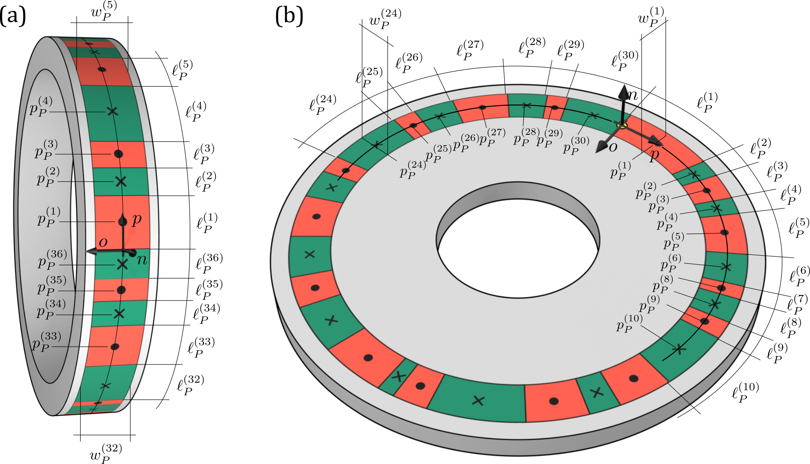{#fig-sec04-18-struktur_pole width=100% fig-pos="h"}

@fig-sec04-18-struktur_pole zeigt eine beispielhafte Strukturbeschreibung von Polmustern in zylindrischen Begrenzungsbox-Geometrien. Dargestellt sind zwei Polräder mit Pseudo-Random-Codierung. In Teilbild (a) ist eine außenliegende Radialspur mit $N_P = 36$ nummerierten Polen gezeigt; in Teilbild (b) eine Axialspur mit $N_P = 30$ nummerierten Polen. Bei radial außenliegenden Spuren wie in Teilbild (a) ist es zweckmäßig, $p_P$ und $\ell_P$ als Bogenlängen anzugeben. Bei der Axialspur in Teilbild (b) ist dies aufgrund des über die Spurbreite veränderlichen Radius hingegen nicht zweckmäßig.

| **Begriff**      | **Symbol**              | **Beschreibung** |
|:-------------|:-------------------:|:-------------|
| **Polanzahl** | $N_P$ | Gesamtzahl der nummerierten Pole |
| **Pollänge**  | $\ell_P^{(j)}$ | Ausdehnung des Pols $j$ in $p$-Richtung |
| **Polbreite** | $w_P^{(j)}$ | Ausdehnung des Pols $j$ in $o$-Richtung |
| **Pollage**   | $\vec{r}_P^{(j)}$ | Position des geometrischen Mittelpunkts der Begrenzungsbox des Pols $j$; Koordinaten $p_P^{(j)}$ und $o_P^{(j)}$ |

: Begriffe Pole {#tbl-begriffe_pole .zebra_blue tbl-colwidths="[25,15,60]"}

### Strukturbegriffe magnetischer Spuren {#sec-04-strukturbegriffe_spuren}

In Begrenzungsbox-Geometrien werden die Abmessungen magnetischer Spuren in $p$-Richtung durch die **Spurlänge** $\ell_T$, in $o$-Richtung durch die **Spurbreite** $w_T$ und in $n$-Richtung durch die **Spurtiefe** $d_T$ beschrieben.

Spuren werden zu Referenzierungszwecken mit dem Ordnungsindex $i = 1, \ldots, N_T$ nummeriert. Bei parallel angeordneten Spuren erfolgt die Nummerierung aufsteigend in positiver $o$-Richtung. Die **Spuranzahl** $N_T$ bezeichnet die Gesamtzahl der nummerierten Spuren.

Die **Spurlage** $\vec{r}_T$ bezeichnet die Position des Spur-KS-Ursprungs $O_T$ im Maßverkörperungs-KS. Ihre Koordinaten sind $p_T$, $o_T$ und $n_T$. Mit der üblichen Festlegung von $O_T$ auf der funktionalen Oberfläche der Maßverkörperung gilt $n_T = 0$.

Die relative Lage zweier Spuren wird durch ihre Versätze beschrieben. Der **Spur-Längsversatz** $p_{TT}$, auch **Spur-$p$-Versatz**, bezeichnet den Versatz in $p$-Richtung. Für die Spuren mit den Ordnungsindizes $i_1$ und $i_2$ gilt:

$$
p_{TT}^{(i_1,i_2)} = p_T^{(i_2)} - p_T^{(i_1)}.
$$

Der **Spur-Querversatz** $o_{TT}$, auch **Spur-$o$-Versatz**, bezeichnet entsprechend den Versatz in $o$-Richtung:

$$
o_{TT}^{(i_1,i_2)} = o_T^{(i_2)} - o_T^{(i_1)}.
$$

Für Größen, die sich auf zwei Spuren beziehen, wird nach @sec-03-indexkonvention der Bezugsindex „TT“ verwendet. Der **Spurabstand** $w_{TT}$ bezeichnet den Abstand in $o$-Richtung zwischen zwei benachbarten Spuren.

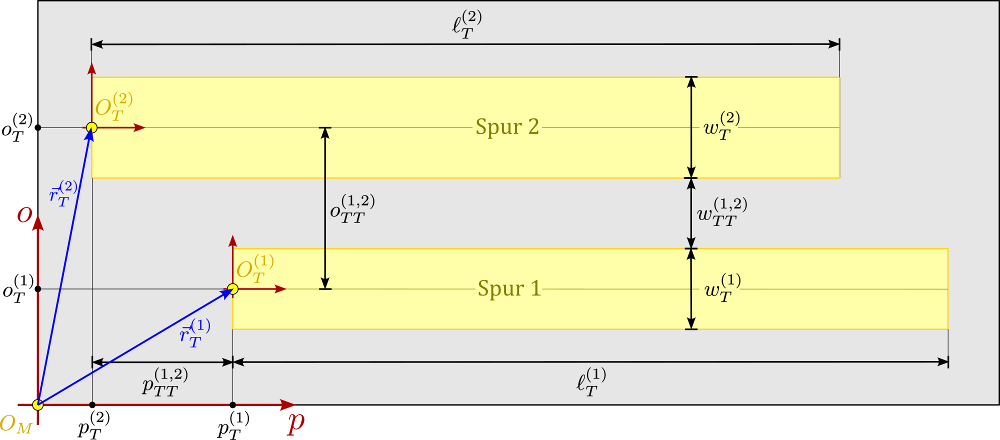{#fig-sec04-19-struktur_spuren width=100% fig-pos="h"}

@fig-sec04-19-struktur_spuren veranschaulicht die eingeführten Spurbegriffe anhand einer schematischen Darstellung eines magnetischen Maßstabs mit zwei parallelen Linearspuren, die gelb hervorgehoben sind. Die Ursprünge der Spur-KS sind entsprechend der eingeführten Konvention in $p$-Richtung am Beginn der jeweiligen Spur und mittig in $o$-Richtung festgelegt. Die relevanten Spurgrößen, insbesondere Spurlage, Spurabmessungen, Spurversätze und Spurabstand, sind in der Abbildung eingezeichnet.

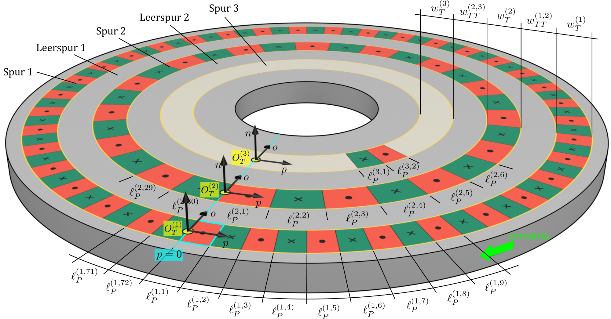{#fig-sec04-20-struktur_spuren2 width=100% fig-pos="h"}

@fig-sec04-20-struktur_spuren2 zeigt einen magnetischen Rotationsmaßstab mit drei axialen Spuren in Poldarstellung. Spur 1 ist als inkrementelle Spur mit $N_P^{(1)} = 72$ Polen ausgeführt, Spur 2 als inkrementelle Spur mit $N_P^{(2)} = 30$ Polen. Spur 3 dient als Referenzspur und enthält ein einzelnes Referenz-Polpaar.

Die Vorwärtsbewegung ist in der Abbildung grün eingezeichnet, woraus sich mit der funktionalen Oberfläche die $p$- und $o$-Richtungen ergeben. Die Ordnungsindizes der Spuren sind entsprechend aufsteigend in positiver $o$-Richtung von außen nach innen vergeben.

Der Beginn des ersten Pols der Spur 1 ist blau hervorgehoben und dient hier als gemeinsamer Strukturbezug für die $p$-Lage der drei Spur-KS. Die dort festgelegte Lage $p = 0$ wird in $o$-Richtung auf die übrigen Spuren übertragen und ist durch eine gepunktete blaue Linie gekennzeichnet. Bei Spur 2 fällt der Ursprung ebenfalls mit dem Beginn des ersten Pols zusammen, während er bei Spur 3 in einem Bereich außerhalb des Referenz-Polpaares liegt. In $o$-Richtung liegen die Ursprünge jeweils mittig auf der zugehörigen Spur. Die Ursprünge und lokalen Koordinatenrichtungen der Spur-KS sind entsprechend eingezeichnet.

Die Ordnungsindizes der Pole steigen in positiver $p$-Richtung an. Exemplarisch dargestellte Pollängen tragen sowohl den Ordnungsindex der Spur als auch den des jeweiligen Pols und veranschaulichen damit die Verwendung mehrerer Ordnungsindizes für spurbezogene Polgrößen.

| **Begriff** | **Symbol** | **Beschreibung** |
|:--------|:------:|:-------------|
| **Spuranzahl** | $N_T$ | Gesamtzahl der nummerierten Spuren |
| **Spurlänge** | $\ell_T^{(i)}$ | Ausdehnung der Spur $i$ in $p$-Richtung |
| **Spurbreite** | $w_T^{(i)}$ | Ausdehnung der Spur $i$ in $o$-Richtung |
| **Spurtiefe** | $d_T^{(i)}$ | Ausdehnung der Spur $i$ in $n$-Richtung |
| **Spurlage** | $\vec{r}_T^{(i)}$ | Position des Spur-KS-Ursprungs $O_T^{(i)}$ der Spur $i$ im Maßverkörperungs-KS; Koordinaten $p_T^{(i)}$, $o_T^{(i)}$ und $n_T^{(i)}$ |
| **Spur-Längsversatz**, **Spur-$p$-Versatz** | $p_{TT}^{(i_1,i_2)}$ | Versatz in $p$-Richtung von Spur $i_1$ zu Spur $i_2$ |
| **Spur-Querversatz**, **Spur-$o$-Versatz** | $o_{TT}^{(i_1,i_2)}$ | Versatz in $o$-Richtung von Spur $i_1$ zu Spur $i_2$ |
| **Spurabstand** | $w_{TT}^{(i,i+1)}$ | Abstand in $o$-Richtung zwischen benachbarten Spuren |

: Begriffe Spuren {#tbl-begriffe_spuren .zebra_blue tbl-colwidths="[25,15,60]"}
