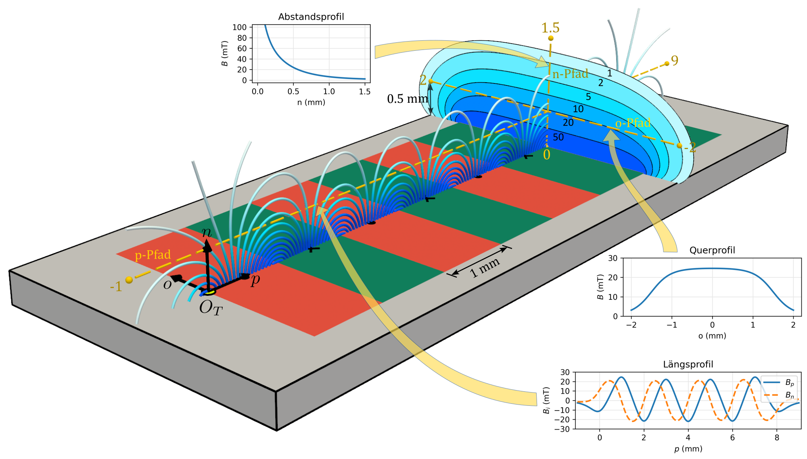
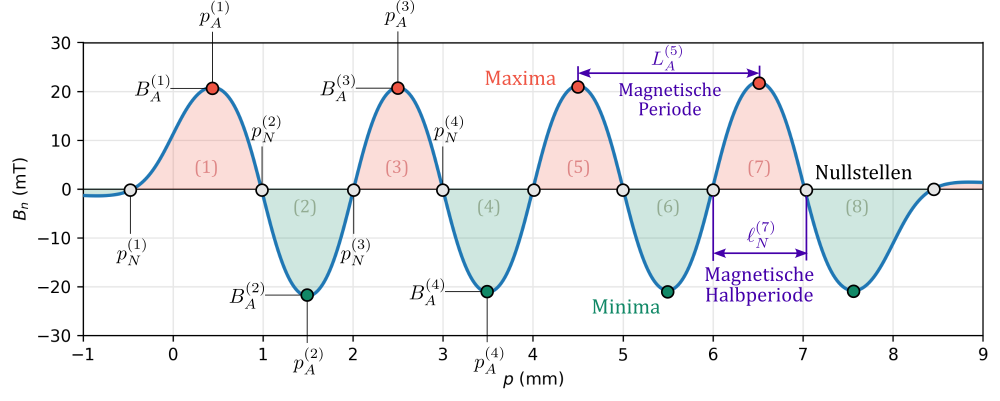
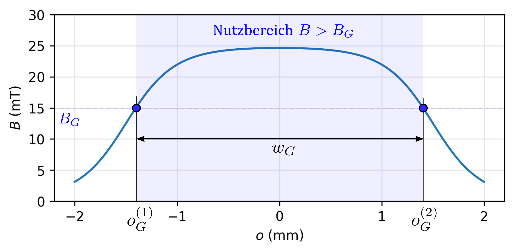
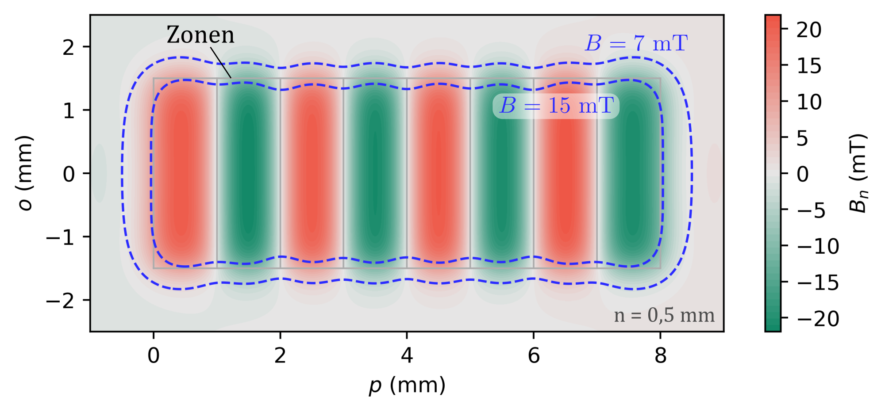
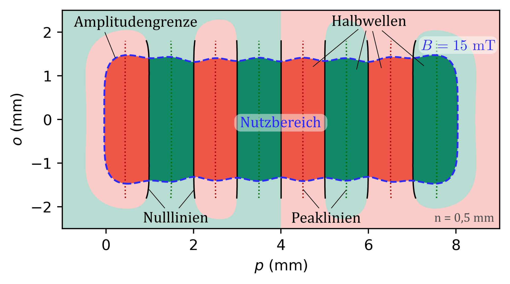
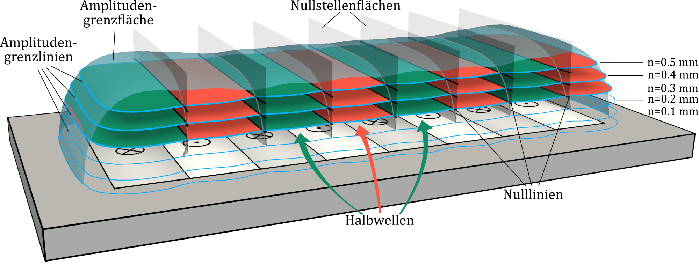
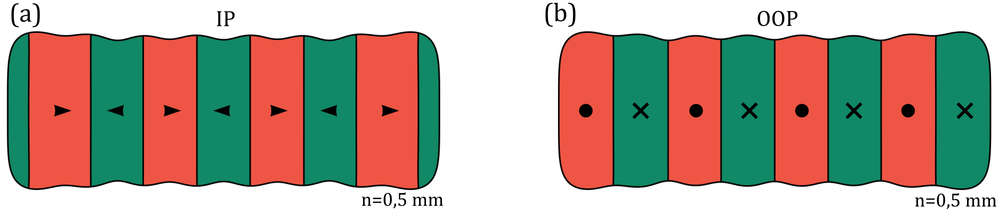
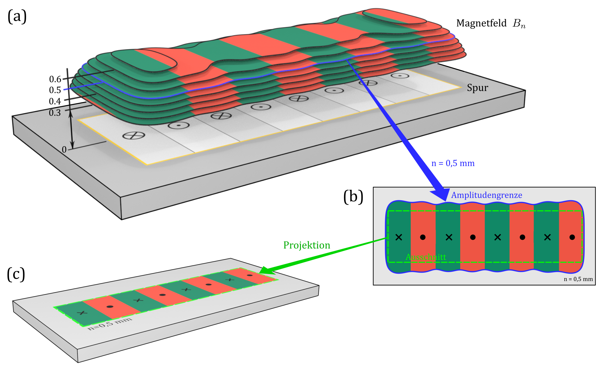
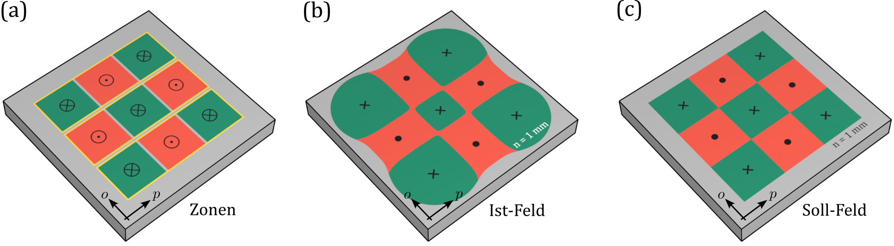
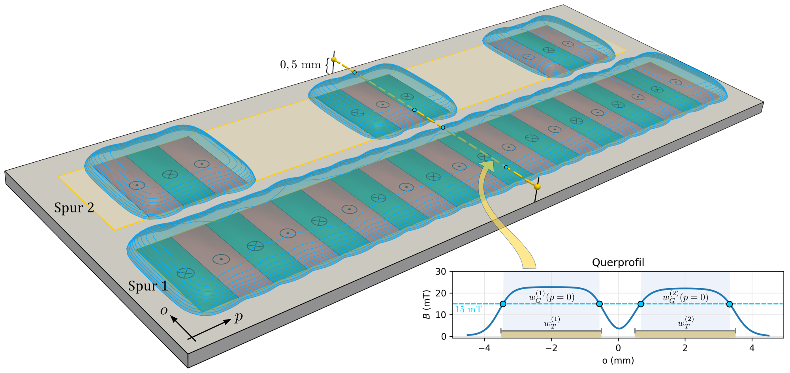

# Streufeld der Maßverkörperung {#sec-05}

Das Streufeld einer Maßverkörperung ergibt sich aus ihrer Polarisation und Geometrie. Im Folgenden werden das Streufeld und charakteristische Feldmerkmale beschrieben, die für die magnetische Vermessung und Bewertung von magnetischen Maßverkörperungen relevant sind.

## Ermittlungsbereich und Feldverläufe {#sec-05-ermittlungsbereich_und_feldverläufe}

Zur Beschreibung und Charakterisierung des Streufeldes wird dieses an räumlichen Lagen relativ zur Maßverkörperung betrachtet. Die Gesamtheit der dabei berücksichtigten Lagen wird als **Ermittlungsbereich** bezeichnet. Ein Ermittlungsbereich kann sich unmittelbar aus der Messaufgabe und der vorgesehenen Relativbewegung nach @sec-03 ergeben oder gezielt für die Vermessung und Charakterisierung der Maßverkörperung festgelegt werden. Seine Lage und Orientierung werden im Maßverkörperungs-KS oder in einem zugeordneten Struktur-KS angegeben.

Ein eindimensionaler Ermittlungsbereich wird als **Messpfad** bezeichnet. Verläuft ein Messpfad entlang einer einzelnen Koordinatenrichtung, wird entsprechend von einem **$p$-Pfad**, **$o$-Pfad** oder **$n$-Pfad** gesprochen. Ein $p$-Pfad folgt damit der $p$-Richtung und kann bei zylindrischen Anordnungen gekrümmt verlaufen.

Beispielsweise beschreibt die Parametrisierung $(p,o,n) = (t, 0{,}1\,\mathrm{mm})$ mit $t \in [0\,\mathrm{mm}, 5\,\mathrm{mm}]$ einen geradlinigen, $5\,\mathrm{mm}$ langen $p$-Pfad bei einer Messhöhe von $1\,\mathrm{mm}$. Ein entsprechender Messpfad ist in @fig-sec05-00-ermittlungsbereiche (a) dargestellt.

Ein zweidimensionaler Ermittlungsbereich wird als **Messfläche**, ein dreidimensionaler Ermittlungsbereich als **Messvolumen** bezeichnet. Analog zu Messpfaden können Messflächen anhand der variierten Koordinatenrichtungen bezeichnet werden. Eine $p$-$o$-Messfläche wird beispielsweise durch Variation von $p$ und $o$ bei konstantem $n$ gebildet.

Die Parametrisierung $(p,o,n) = (t,u,1\,\mathrm{mm})$ mit $t \in [0^\circ, 360^\circ]$ und $u \in [-1\,\mathrm{mm}, 1\,\mathrm{mm}]$ beschreibt beispielsweise eine $2\,\mathrm{mm}$ breite $p$-$o$-Messfläche bei einer Messhöhe von $1\,\mathrm{mm}$. Diese Messfläche ist in @fig-sec05-00-ermittlungsbereiche (e) in einer radialen Anordnung und in Teilbild (f) in einer axialen Anordnung dargestellt.

{#fig-sec05-00-ermittlungsbereiche width=100%}

@fig-sec05-00-ermittlungsbereiche zeigt beispielhafte Ermittlungsbereiche für lineare, radiale und axiale Anordnungen. In den Teilbildern (a) bis (c) sind $p$-Pfade bei konstanten $o$ und $n$, in den Teilbildern (d) bis (f) $p$-$o$-Messflächen bei konstanten Messhöhen $n$ dargestellt.

## Streufeld einer Maßverkörperung {#sec-05-streufeld_einer_maßverkörperung}

Wie in @sec-04-magnetpole erläutert, lässt sich die Streufeldcharakteristik einer magnetischen Maßverkörperung qualitativ durch den Austritt der magnetischen Feldlinien an den Nordpolen und ihren Eintritt an den Südpolen beschreiben. Die einzelnen Komponenten $B_p$ und $B_n$ weisen dabei in $p$-Richtung typischerweise einen wellenförmigen Verlauf mit Maxima, Minima und Nullstellen auf. Mit zunehmendem Abstand von der magnetischen Struktur nimmt die Amplitude des Streufeldes ab. Dieser Abfall erfolgt im Fernfeld einzelner Zonen näherungsweise kubisch und bei der Überlagerung der Streufelder mehrerer alternierender Zonen näherungsweise exponentiell [@ausserlechner2012closed].

{#fig-sec05-01-streufeldcharakteristik width=100%}

@fig-sec05-01-streufeldcharakteristik zeigt das **Simulationsergebnis** eines Multipolmagneten aus acht homogenen, alternierend OOP-polarisierten Zonen mit Polarisationsamplituden $J_Z = 300\,\mathrm{mT}$, Längen $\ell_Z = 1\,\mathrm{mm}$, Breiten $w_Z = 3\,\mathrm{mm}$ und Tiefen $d_Z = 200\,\mu\mathrm{m}$. Die Maßverkörperung ist in Poldarstellung gezeigt. Das resultierende Streufeld ist in Form von Feldlinien mittig über der Maßverkörperung sowie einer blauen Konturdarstellung der Streufeldamplitude in einer $o$-$n$-Ebene dargestellt. In beiden Darstellungen codiert die blaue Farbskala den Wert der Streufeldamplitude in Millitesla. Zur Veranschaulichung der Streufeldcharakteristik sind zusätzlich Feldverläufe entlang der eingezeichneten Messpfade in den Teilbildern abgebildet.

**In $p$-Richtung** spiegelt das Streufeld die periodische Struktur des Polmusters wider. Die charakteristische Oszillation der Komponenten $B_p$ und $B_n$ des Streufeldes entlang des eingezeichneten $p$-Pfades ist im Längsprofil erkennbar. Die Komponenten sind gegeneinander typischerweise um etwa $90^\circ$ phasenverschoben, eine Eigenschaft, die in vielen Anwendungen zur Positionsbestimmung genutzt wird.

**In $o$-Richtung** ist die Streufeldcharakteristik durch einen raschen Abfall der Feldamplitude über die seitliche Begrenzung der magnetischen Struktur hinaus gekennzeichnet. Dies ist auch aus dem typischen Querprofil ersichtlich, in dem die Feldamplitude entlang des eingezeichneten $o$-Pfades abgebildet ist. Das Querprofil verdeutlicht, dass sich das Streufeld bei komplexen Anordnungen in der Regel auf einen begrenzten Bereich oberhalb der magnetischen Struktur konzentriert.

**In $n$-Richtung** ist die starke Abschwächung der Feldamplitude mit wachsendem Abstand von der magnetischen Struktur sowohl an der Konturdarstellung als auch am Abstandsprofil ersichtlich. Der rasche Zerfall der Feldamplitude begrenzt den nutzbaren Messabstand und erfordert eine präzise Positionierung der Sensorik nahe der funktionalen Oberfläche der Maßverkörperung, was mit erheblichen technischen Herausforderungen verbunden sein kann.

In $o$- und $n$-Richtung ist die Streufeldcharakteristik insbesondere durch die Abnahme der Feldamplitude mit zunehmendem Abstand von der magnetischen Struktur geprägt. Für die Anwendung ist dabei entscheidend, dass die **Feldamplitude** innerhalb eines festgelegten Wertebereichs liegt, da unterschiedliche Sensortechnologien und Sensorausführungen nur innerhalb bestimmter Feldamplitudenbereiche spezifizierte Messeigenschaften aufweisen.

Ein unterer **Amplitudengrenzwert** kann sich beispielsweise aus dem erforderlichen Signal-Rausch-Verhältnis eines Sensors ergeben, während ein oberer Amplitudengrenzwert durch den zulässigen Mess- oder Linearitätsbereich bestimmt sein kann. Ein **Nutzbereich** wird durch eine oder mehrere für die Anwendung festgelegte Amplitudenbedingungen definiert.

## Feldmerkmale auf Messpfaden {#sec-05-feldmerkmale_auf_messpfaden}

Zur Beschreibung des Streufeldes wird in der Praxis auf bestimmte Merkmale von Feldverläufen Bezug genommen. Im Folgenden werden hierzu zunächst eindimensionale Feldverläufe entlang ausgewählter Messpfade betrachtet.

**Entlang eines $p$-Pfades** stellen insbesondere die lokalen Maxima und Minima einer betrachteten Feldkomponente $B_\alpha$, insbesondere $B_p$ und $B_n$, die im Folgenden zusammenfassend als **Peaks** (Bezugsindex „A“) bezeichnet werden, sowie die **Nullstellen** (Bezugsindex „N“) charakteristische Merkmale eines Feldverlaufs dar. Sie werden in vielen Anwendungen für die Positionserkennung genutzt.

Die $p$-Position eines Peaks wird als **Peaklage** $p_A$, die einer Nullstelle als **Nullstellenlage** $p_N$ bezeichnet. Der Wert der betrachteten Feldkomponente an einem Peak wird als **Peakamplitude** $B_A$ bezeichnet. Zur eindeutigen Kennzeichnung werden Peaks und Nullstellen beginnend mit 1, entlang der positiven $p$-Richtung fortlaufend nummeriert. Die Indizierung wird im Normalfall so gewählt, dass auf die Nullstelle $j$ der Peak $j$ folgt. Die **Peakanzahl** $N_A$ und die **Nullstellenanzahl** $N_N$ geben die Gesamtzahl der jeweils indizierten Merkmale an. Eine vollständige Indizierung aller Peaks und Nullstellen ist nicht erforderlich.

Ein weiteres wichtiges Merkmal eines Feldverlaufs entlang eines $p$-Pfades ist die Länge seiner Schwingungen. Die **magnetische Halbperiode** bezeichnet den Abstand in $p$-Richtung zwischen zwei benachbarten Merkmalen gleicher Art. Dabei bezeichnet $\ell_A$ den Abstand zwischen zwei benachbarten Peaks entgegengesetzten Vorzeichens und $\ell_N$ den Abstand zwischen zwei benachbarten Nullstellen:

$$
\ell_A^{(j)} = p_A^{(j+1)} - p_A^{(j)},
$$

$$
\ell_N^{(j)} = p_N^{(j+1)} - p_N^{(j)}.
$$

Die **magnetische Periode** beschreibt entsprechend die lokale Länge einer vollständigen Schwingung. Sie wird aus dem Abstand jedes zweiten Merkmals gleicher Art bestimmt:

$$
L_A^{(j)} = p_A^{(j+2)} - p_A^{(j)}
= \ell_A^{(j)} + \ell_A^{(j+1)},
$$

$$
L_N^{(j)} = p_N^{(j+2)} - p_N^{(j)}
= \ell_N^{(j)} + \ell_N^{(j+1)}.
$$

Da die Feldverläufe im Allgemeinen nicht streng periodisch sind, handelt es sich bei der magnetischen Halbperiode und der magnetischen Periode um lokale Größen, deren Werte entlang des Feldverlaufs variieren können.

{#fig-sec05-02-langsprofil width=100%}

@fig-sec05-02-langsprofil zeigt das Längsprofil $B_n(p)$ entlang des in @fig-sec05-01-streufeldcharakteristik dargestellten $p$-Pfades in detaillierter Form. Peaklagen, Nullstellenlagen, magnetische Halbperioden und magnetische Perioden sind eingezeichnet. Positive und negative Halbwellen sind zur Veranschaulichung rot beziehungsweise grün hervorgehoben.

Die **Halbwelle** benennt den Abschnitt eines Feldverlaufs, der zwischen zwei benachbarten Nullstellen liegt. Innerhalb einer Halbwelle weist die betrachtete Feldkomponente ein einheitliches Vorzeichen auf. Der Begriff ermöglicht eine eindeutige Bezugnahme auf einzelne Abschnitte des Feldverlaufs und wird für deren Beschreibung und Vermessung verwendet.

Halbwellen werden, beginnend mit 1, entlang der positiven $p$-Richtung fortlaufend nummeriert. Die Halbwelle $j$ liegt zwischen den Nullstellen mit den Indizes $j$ und $j + 1$ und enthält den Peak $j$. Ihre Ausdehnung in $p$-Richtung entspricht der nullstellenbezogenen Halbperiode $\ell_N^{(j)}$.

**Entlang eines $o$-Pfades** ist insbesondere der seitliche Verlauf der Feldamplitude von Bedeutung. Charakteristische Merkmale eines Feldverlaufs $B(o)$ sind die **Amplitudengrenzpunkte**. Sie kennzeichnen die **Amplitudengrenzlagen** $o_G$, an denen die Feldamplitude einen vorgegebenen **Amplitudengrenzwert** $B_G$ annimmt, und werden, beginnend mit 1, entlang der positiven Pfadrichtung fortlaufend nummeriert.

Die Amplitudengrenzpunkte begrenzen den Nutzbereich entlang des betrachteten Messpfades. Die **Nutzbereichsbreite** $w_G(p)$ entspricht dessen Ausdehnung in $o$-Richtung an der Position $p$. Wird die Nutzbereichsbreite innerhalb einer Halbwelle $j$ bestimmt, wird sie als **Nutzbreite der Halbwelle** $w_G^{(j)}(p)$ bezeichnet.

{#fig-sec05-03-querprofil width=70%}

@fig-sec05-03-querprofil zeigt das Querprofil $B(o)$ entlang des in @fig-sec05-01-streufeldcharakteristik dargestellten $o$-Pfades in detaillierter Form. Ein unterer Amplitudengrenzwert $B_G$ definiert einen Nutzbereich. Die beiden resultierenden Amplitudengrenzpunkte sind blau eingezeichnet. Ihre $o$-Lagen entsprechen den Amplitudengrenzlagen $o_G^{(1)}$ und $o_G^{(2)}$, die den Nutzbereich begrenzen.

::: {.callout-tip}
## HINWEIS

*Die in diesem Kapitel dargestellten Feldverläufe zeigen idealisierte beziehungsweise für viele Anwendungen angestrebte Kurven mit eindeutig ausgeprägten und gut auswertbaren Feldmerkmalen. Reale Feldverläufe können hiervon infolge von Fertigungsabweichungen, Materialinhomogenitäten und Randeffekten abweichen. Insbesondere bei sehr kleinen Messhöhen, $n \ll \ell_P$, treten höhere räumliche Harmonische deutlicher hervor, wodurch beispielsweise zusätzliche Peaks und Nullstellen, **Doppelpeaks** oder komplexere Feldverläufe auftreten können.*

:::

| Begriff | Symbol | Beschreibung |
|:--------|:------:|:-------------|
| **Peaklage** | $p_A^{(j)}$ | $p$-Position des Peaks $j$ |
| **Peakamplitude** | $B_A^{(j)}$ | Wert der betrachteten Feldkomponente am Peak $j$ |
| **Nullstellenlage** | $p_N^{(j)}$ | $p$-Position der Nullstelle $j$ |
| **Magnetische Halbperiode** | $\ell_A^{(j)}$, $\ell_N^{(j)}$ | Lokale Länge einer halben Schwingung, bestimmt aus Peaks bzw. Nullstellen mit Indizes $j$ und $j + 1$ |
| **Magnetische Periode** | $L_A^{(j)}$, $L_N^{(j)}$ | Lokale Länge einer vollständigen Schwingung, bestimmt aus Peaks bzw. Nullstellen mit Indizes $j$ und $j + 2$ |
| **Amplitudengrenzwert** | $B_G$ | Für die Anwendung festgelegter Grenzwert der Feldamplitude |
| **Amplitudengrenzlage** | $o_G^{(j)}$ | $o$-Lage des Amplitudengrenzpunkts $j$ |
| **Nutzbereichsbreite** | $w_G(p)$ | Ausdehnung des Nutzbereichs in $o$-Richtung an der Position $p$ |
| **Nutzbreite der Halbwelle** | $w_G^{(j)}(p)$ | Nutzbereichsbreite innerhalb der Halbwelle $j$ |

: Begriffe Feldmerkmale {.zebra_blue #tbl-begriffe-feldmerkmale tbl-colwidths="[20,15,55]"}

## Feldmerkmale auf Messflächen und im Raum {#sec-05-feldmerkmale_flaechen_raum}

**Messflächen** geben einen zweidimensionalen Einblick in die Streufeldcharakteristik. Besonders zweckmäßig ist dafür die Darstellung einer anwendungsrelevanten Streufeldkomponente auf einer $p$-$o$-Messfläche bei konstanter Messhöhe $n$. Amplitudengrenzen, die den Nutzbereich eingrenzen, erscheinen auf einer solchen Messfläche als Konturlinien der Feldamplitude und werden dem Feldverlauf häufig ergänzend überlagert.

{#fig-sec05-04-feldverlauf_2D width=75%}

@fig-sec05-04-feldverlauf_2D zeigt den Feldverlauf $B_n(p,o)$ der in @sec-05-streufeld_einer_maßverkörperung beschriebenen Maßverkörperung bei der Messhöhe $n = 0{,}5\,\mathrm{mm}$. Die Projektion der darunterliegenden Zonen, die das Streufeld erzeugen, ist grau umrandet. Zusätzlich sind die Konturlinien der Feldamplitude für die Amplitudengrenzwerte $B_G = 7\,\mathrm{mT}$ und $B_G = 15\,\mathrm{mT}$ eingezeichnet. Sie veranschaulichen die Abgrenzung möglicher Nutzbereiche auf der Messfläche. Die Farbwahl bei der Darstellung des Feldverlaufs folgt der in @sec-04-darstellungskonventionen festgelegten Darstellungskonvention.

@fig-sec05-04-feldverlauf_2D veranschaulicht zwei **grundlegende Eigenschaften** des Feldverlaufs. In $p$-Richtung oszilliert die dargestellte Feldkomponente, wobei positive Halbwellen rot und negative Halbwellen grün dargestellt sind. Über die seitliche Begrenzung der magnetischen Struktur hinaus nimmt die Amplitude des Feldes rasch ab.

Für Kommunikationszwecke wird der zweidimensionale Feldverlauf häufig auf ein binäres Farbmuster reduziert, was eine kompakte und anschauliche Darstellung der wesentlichen Feldmerkmale ermöglicht. Bei den Amplitudengrenzen handelt es sich um zweidimensionale Fortsetzungen der auf Messpfaden auftretenden Grenzpunkte. Gleichermaßen setzen sich die Nullstellen auf der Messfläche zu **Nulllinien** fort. Sie bilden die Grenzen benachbarter Halbwellen. Peaklagen setzen sich zu **Peaklinien** fort, bei denen es sich mathematisch um Extremwertlinien in $p$-Richtung handelt.

{#fig-sec05-05-feldverlauf_2D_binar width=75%}

@fig-sec05-05-feldverlauf_2D_binar zeigt den Feldverlauf $B_n(p,o)$ aus @fig-sec05-04-feldverlauf_2D in binärer Farbdarstellung. Dem Farbmuster sind die Feldmerkmale in Form von Nulllinien und Peaklinien sowie die Amplitudengrenzlinie für $B_G = 15\,\mathrm{mT}$ überlagert. Der durch diesen Amplitudengrenzwert festgelegte Nutzbereich ist farblich hervorgehoben. Die Nulllinien gliedern ihn sichtbar in positive und negative Halbwellen.

Innerhalb des Nutzbereichs weisen die Komponenten $B_p$ und $B_n$ typischerweise eine geordnete, **wellenförmige Struktur** auf, die eine eindeutige Abgrenzung und Zuordnung der Halbwellen ermöglicht. Außerhalb des Nutzbereichs ist diese geordnete Struktur nicht notwendigerweise erhalten, wie auch in der Abbildung erkennbar. Nulllinien können dort zusammenlaufen oder sich so verändern, dass einzelne Halbwellen nicht mehr eindeutig abgegrenzt und fortlaufend zugeordnet werden können. Für die anwendungsbezogene Referenzierung nach @sec-05-feldmerkmale_auf_messpfaden werden auf Messflächen daher vorrangig die innerhalb des Nutzbereichs liegenden Halbwellen betrachtet.

Feldverläufe auf Messpfaden und Messflächen zeigen jeweils nur Ausschnitte des **räumlichen Streufeldes** einer Maßverkörperung. Seine Struktur in ihrer Gesamtheit zu verstehen, ist für die Auslegung magnetischer Messsysteme von wesentlicher Bedeutung.

Die räumlichen Fortsetzungen der Nullstellen werden als **Nullstellenflächen** bezeichnet. Mathematisch handelt es sich um Isoflächen einer betrachteten Feldkomponente zum Feldwert null. Sie werden durch folgende Gleichung beschrieben:

$$
B_\alpha(p,o,n) = 0.
$$

Die räumlichen Fortsetzungen der Peaklagen werden als **Peakflächen** bezeichnet. Dabei handelt es sich um Extremwertflächen der betrachteten Feldkomponente in $p$-Richtung, für die notwendigerweise gilt:

$$
\frac{\partial}{\partial p} B_\alpha(p,o,n) = 0.
$$

Amplitudengrenzen sind räumlich durch **Amplitudengrenzflächen** definiert. Sie sind Isoflächen der Streufeldamplitude zu einem festgelegten Amplitudengrenzwert $B_G$:

$$
B(p,o,n) = B_G.
$$

Wenn Messpfade und Messflächen diese räumlichen Flächen schneiden, entstehen **Schnittpunkte** beziehungsweise **Schnittlinien**. Der Schnitt einer Nullstellenfläche mit einem Messpfad ergibt eine Nullstelle, der Schnitt mit einer Messfläche eine Nulllinie. Entsprechend ergeben sich aus dem Schnitt mit Peakflächen Peaklagen beziehungsweise Peaklinien und aus den Schnitten mit Amplitudengrenzflächen Amplitudengrenzpunkte beziehungsweise Amplitudengrenzlinien.

Im dreidimensionalen Raum wird der **Nutzbereich** durch Amplitudengrenzflächen begrenzt und durch Nullstellenflächen in Halbwellen unterteilt.

{#fig-sec05-06-feldverlauf_3D width=100%}

@fig-sec05-06-feldverlauf_3D veranschaulicht die räumliche Anordnung ausgewählter Merkmale der OOP-Komponente des Streufeldes über der in @sec-05-streufeld_einer_maßverkörperung beschriebenen Maßverkörperung. Die Amplitudengrenzfläche des durch $B_G = 15\,\mathrm{mT}$ festgelegten Nutzbereichs ist blau dargestellt. Sie bildet eine blasenförmige Hüllfläche über der Maßverkörperung, die in der Abbildung zur besseren Sichtbarkeit nach vorne hin aufgeschnitten dargestellt ist. In der Abbildung ist die $n$-Koordinate um einen Faktor 2 gestreckt, damit die Feldverteilung besser erkennbar ist.

Innerhalb des Nutzbereichs ist die Feldkomponente $B_n$ auf den $p$-$o$-Messflächen bei $n = 0{,}4\,\mathrm{mm}$, $n = 0{,}5\,\mathrm{mm}$ und $n = 0{,}6\,\mathrm{mm}$ in binärer Farbdarstellung gezeigt. Die Schnittlinien dieser Messflächen mit der Amplitudengrenzfläche bilden die zugehörigen Amplitudengrenzlinien und sind hellblau hervorgehoben.

Die Nullstellenflächen unterteilen den Nutzbereich in Halbwellen. Die Schnittlinien der Nullstellenflächen mit den Messflächen erscheinen als schwarz hervorgehobene Nulllinien, welche die Halbwellen auf den jeweiligen Messflächen voneinander trennen. Die Schnittlinien der Nullstellenflächen mit der Amplitudengrenzfläche sind grau hervorgehoben. Sie besitzen in diesem Beispiel keine eigenständige technische Bedeutung und dienen ausschließlich der besseren Erkennbarkeit der räumlichen Anordnung.

::: {.callout-tip}
## HINWEIS

*Die vorangehenden Unterkapitel verdeutlichen, dass Feldverläufe und die daraus abgeleiteten Feldmerkmale wesentlich von den jeweiligen **Ermittlungsbedingungen** abhängen. Hierzu zählen insbesondere die Feldkomponente sowie Lage, Orientierung und Abmessungen des Ermittlungsbereichs und gegebenenfalls die verwendeten Amplitudengrenzwerte. Eine korrekte Interpretation eines Feldverlaufs ist nur bei Angabe der Ermittlungsbedingungen möglich.*

:::

## Felddarstellung {#sec-05-felddarstellung}

Im Sinne dieses Dokuments bezeichnet eine **Felddarstellung** ausschließlich eine nach @sec-04-darstellungskonventionen farbcodierte Darstellung einer ausgewählten Feldkomponente auf einer Messfläche.

Diese Form der Felddarstellung dient der Kommunikation der Feldverläufe und Feldmerkmale magnetischer Maßverkörperungen. Sie ist insbesondere an der **Schnittstelle** zwischen Maßverkörperungshersteller und Systemhersteller von Bedeutung. Einerseits kann damit die für die Systemauslegung erforderlichen Feldverläufe spezifiziert werden. Andererseits lassen sich die von einer konkreten Maßverkörperung tatsächlich erzeugten Feldverläufe beschreiben. In beiden Fällen wird das Magnetfeld als Eigenschaft der Maßverkörperung und unabhängig von den Eigenschaften eines bestimmten Sensors betrachtet.

Besonders **zweckmäßig** ist die Felddarstellung auf einer $p$-$o$-Messfläche bei festgelegter Messhöhe $n$. Für Kommunikation eignet sich die binäre Form nach @fig-sec05-05-feldverlauf_2D_binar, da sie die wesentlichen Feldmerkmale kompakt und anschaulich vermittelt.

In einer Felddarstellung muss die dargestellte Streufeldkomponente eindeutig erkennbar sein. Dazu werden die in @sec-04-darstellungskonventionen festgelegten **Richtungssymbole** verwendet, welche die Ausrichtung der Feldkomponente und die Vorzeichen der dargestellten Halbwellen eindeutig kennzeichnen.

{#fig-sec05-07-feldprofil_ip_op width=100%}

@fig-sec05-07-feldprofil_ip_op zeigt binäre Felddarstellungen der in @sec-05-streufeld_einer_maßverkörperung beschriebenen Maßverkörperung auf einer $p$-$o$-Messfläche bei der Messhöhe $n = 0{,}5\,\mathrm{mm}$. Die Felddarstellungen sind jeweils auf den durch den Amplitudengrenzwert $B_G = 15\,\mathrm{mT}$ festgelegten Nutzbereich beschränkt. Teilbild (a) zeigt die IP-Komponente $B_p$, Teilbild (b) die OOP-Komponente $B_n$. Die Richtungssymbole sind entsprechend der Darstellungskonvention ausgeführt.

Bei Felddarstellungen auf $p$-$o$-Messflächen nimmt die Messhöhe $n$ eine zentrale Stellung ein, da sie Lage und Form der dargestellten Feldmerkmale wesentlich beeinflusst. Felddarstellungen werden aber häufig in Aufsicht gezeigt, sodass sich der Abstand der Messfläche von der Maßverkörperung aus der Darstellung nicht unmittelbar erschließen lässt. Es wird daher empfohlen, die **Messhöhe unmittelbar in der Felddarstellung anzugeben**, wie in @fig-sec05-07-feldprofil_ip_op gezeigt. Diese Angabe ermöglicht zugleich eine eindeutige Abgrenzung gegenüber der Poldarstellung.

::: {.callout-tip}
## HINWEIS

*Die Poldarstellung sowie die Darstellung der Normalkomponente nach @sec-04-darstellungskonventionen sind **Spezialfälle der Felddarstellung**. Beide Darstellungen zeigen die OOP-Komponente des Magnetfeldes auf der Oberfläche der Maßverkörperung ($n = 0$).*

:::

Eine Felddarstellung wird häufig auf die funktionale Oberfläche der Maßverkörperung **projiziert**, um einen unmittelbaren örtlichen Bezug zwischen Feldmerkmalen und Bauteilgeometrie herzustellen. Je nach Bedarf kann sie dabei unabhängig von Amplitudengrenzen auf einen **relevanten Ausschnitt** beschränkt werden.

{#fig-sec05-08-felddarstellung_projektion width=100%}

@fig-sec05-08-felddarstellung_projektion veranschaulicht die Projektion einer Felddarstellung auf die funktionale Oberfläche der Maßverkörperung. Teilbild (a) zeigt die in @sec-05-streufeld_einer_maßverkörperung beschriebene Maßverkörperung in Zonendarstellung. Darüber ist die aus einer Simulation ermittelte Feldkomponente $B_n$ auf mehreren, parallel zur funktionalen Oberfläche angeordneten Messflächen binär dargestellt. Jede Fläche ist dabei auf den Nutzbereich $B > 15\,\mathrm{mT}$ beschränkt. Der Abstand zwischen der Maßverkörperung und der untersten Messfläche ist zur besseren Sichtbarkeit künstlich vergrößert.

Teilbild (b) zeigt die Messfläche bei $n = 0{,}5\,\mathrm{mm}$ in Aufsicht. Ein für die Anwendung relevanter Ausschnitt, beispielsweise der Bereich der vorgesehenen Sensorpositionierung, ist hellgrün strichliert umrahmt. Teilbild (c) zeigt die Maßverkörperung mit der auf ihre funktionale Oberfläche projizierten Felddarstellung. Die Projektion ist auf den in Teilbild (b) gekennzeichneten Ausschnitt beschränkt.

Die bisher gezeigten Felddarstellungen geben ermittelte Feldverläufe konkreter Maßverkörperungen wieder und sind daher als **Ist-Darstellungen** zu verstehen. Die Ermittlung kann durch Messung oder durch Simulation erfolgen. An der Schnittstelle zwischen Systemhersteller und Maßverkörperungshersteller werden Felddarstellungen dagegen häufig als **Soll-Darstellungen** eingesetzt. Sie beschreiben geforderte Feldverläufe und dienen der Spezifikation und Kommunikation, ohne eine konkrete Realisierung vorauszusetzen.

{#fig-sec05-09-felddarstellung_soll_ist width=100%}

@fig-sec05-09-felddarstellung_soll_ist zeigt ein magnetisches Schachbrettmuster in verschiedenen Darstellungsformen. Teilbild (a) zeigt die Maßverkörperung in farbcodierter Zonendarstellung. Zu sehen ist eine graue Halterung mit eingepressten kubischen Magneten, zwischen denen schmale Spalte erkennbar sind. Die Magnete bilden drei parallele Spuren. Die Darstellung beschreibt den strukturellen Aufbau und die Anordnung der magnetisierten Zonen.

Teilbild (b) zeigt eine Ist-Felddarstellung in binärer Form. Sie ist auf einen amplitudenbezogenen Nutzbereich beschränkt und auf die Maßverkörperung projiziert. Der zugrunde liegende Feldverlauf wurde durch Simulation des Magnetfeldes der in Teilbild (a) gezeigten Maßverkörperung auf einer $p$-$o$-Messfläche bei der Messhöhe $n = 1\,\mathrm{mm}$ ermittelt.

Teilbild (c) zeigt eine Soll-Felddarstellung in binärer Form. Sie stellt weder einen Ausschnitt des in Teilbild (b) dargestellten Feldverlaufs noch das Ergebnis einer Messung oder Simulation dar. Vielmehr dient sie der Beschreibung gewünschter Feldmerkmale und könnte beispielsweise eine Bedarfsanforderung oder Zielvorgabe für die Auslegung einer Maßverkörperung repräsentieren.

::: {.callout-tip}
## HINWEIS

*Die vorgestellten **Darstellungsformen** können sich in ihrer grafischen Erscheinung stark ähneln, unterscheiden sich jedoch grundlegend hinsichtlich ihrer Bedeutung und ihres Informationsgehalts. Bei der **Interpretation** ist besonders darauf zu achten, welche Darstellungsform vorliegt.*

:::

## Spurfelder {#sec-05-spurfelder}

Die bisherigen Unterkapitel beschreiben das Streufeld einer Maßverkörperung unabhängig von einer Gliederung der magnetischen Struktur in Spuren. Bei magnetischen Maßstäben mit mehreren Spuren wird das von einer einzelnen Spur erzeugte Magnetfeld als **Spurfeld** bezeichnet. Das gesamte Streufeld des Maßstabs ergibt sich aus der Überlagerung der einzelnen Spurfelder.

Bei der Vermessung einer Spur ist auf den **Einfluss benachbarter Spurfelder** zu achten, da experimentell grundsätzlich das Gesamtfeld erfasst wird. In vielen praktischen Anwendungen wird deshalb der Spurabstand so gewählt, dass dieser Einfluss gering bleibt. Dies wird durch den raschen Abfall der Spurfelder über die seitlichen Begrenzungen der jeweiligen Spur hinaus begünstigt. Bei geeignet gewähltem Spurabstand können die Nutzbereiche, die aus dem Gesamtfeld ermittelt werden, räumlich voneinander getrennt sein und den darunterliegenden Spuren eindeutig zugeordnet werden.

{#fig-sec05-10-spurfeld width=100%}

@fig-sec05-10-spurfeld zeigt die Simulation eines magnetischen Maßstabs mit zwei parallelen OOP-polarisierten Linearspuren: einer vollbeschriebenen Inkrementalspur und einer segmentierten Spur mit drei Referenzbereichen. In der Simulation wurden die Zonen als homogen, mit einer Polarisation von $J_Z = 350\,\mathrm{mT}$ modelliert. Die Spurbreiten betragen $w_T = 3\,\mathrm{mm}$, der Spurabstand $w_{TT} = 1\,\mathrm{mm}$. Die Zonenlängen betragen $\ell_Z = 1\,\mathrm{mm}$ und die Zonentiefe $d_Z = 200\,\mu\mathrm{m}$. Die für den Amplitudengrenzwert $B_G = 15\,\mathrm{mT}$ ermittelten Nutzbereiche sind durch ihre Amplitudengrenzflächen als blaue, blasenförmige Hüllflächen über dem Maßstab dargestellt.

Das Querprofil der Feldamplitude $|\vec{B}|$ entlang des eingezeichneten $o$-Pfades bei einer Messhöhe von $0{,}5\,\mathrm{mm}$ ist in einem Teilbild gezeigt. Aufgrund des starken seitlichen Abfalls der Feldamplitude über die Spuren hinaus ergeben sich unter den gewählten Ermittlungsbedingungen voneinander **getrennte Nutzbereiche**. Das Querprofil zeigt, dass die Nutzbereichsbreiten $w_G$ bei dieser Messhöhe für beide Spuren geringer sind als die jeweiligen Spurbreiten $w_T$.

Wie in der Abbildung erkennbar, hängen Lage und Abmessungen der Nutzbereiche wesentlich von den zugrunde liegenden Zonenmustern ab. Der vollbeschriebenen Inkrementalspur ist ein langer, zusammenhängender Nutzbereich zugeordnet. Der segmentierten Spur sind dagegen drei voneinander getrennte Nutzbereiche zugeordnet, die über den drei Referenzbereichen liegen. Besitzt eine Spur **mehrere Nutzbereiche**, werden diese, beginnend mit 1, entlang der positiven $p$-Richtung fortlaufend nummeriert.
