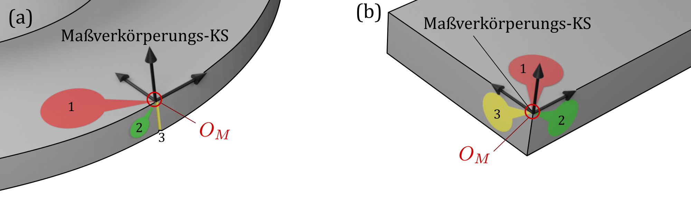
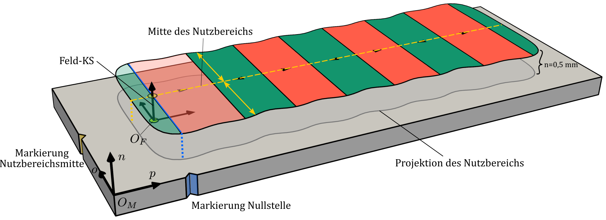
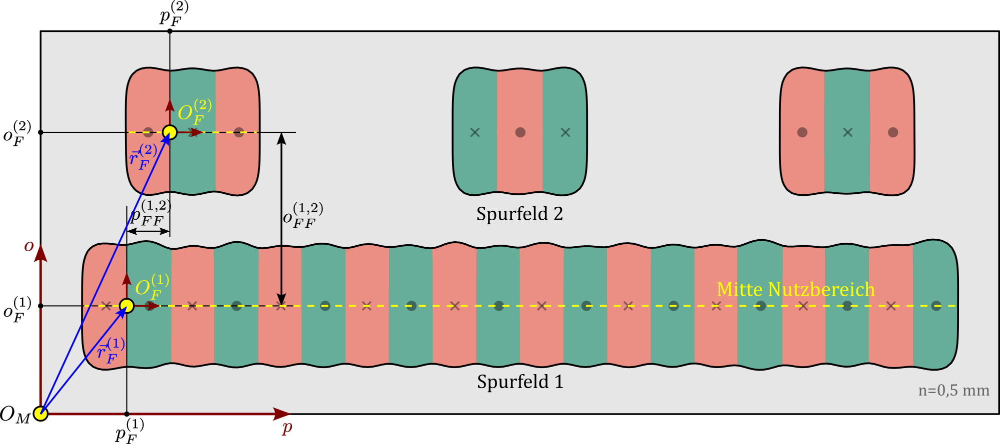
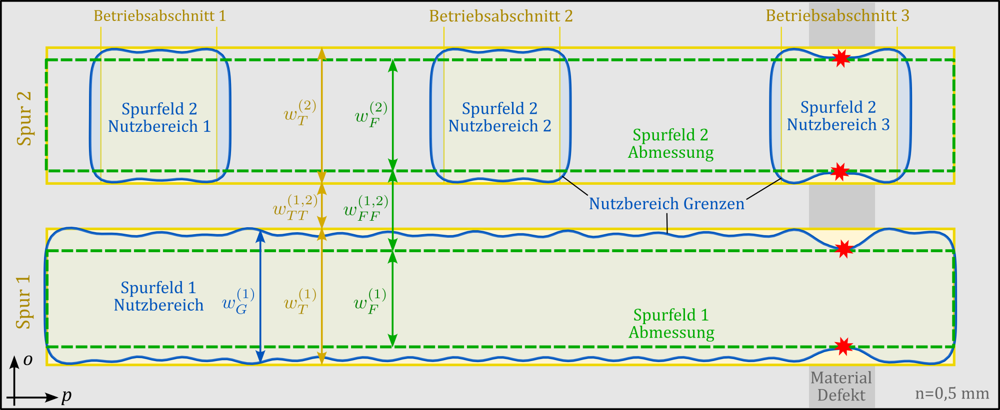

# Grundlagen der Vermessung {#sec-06}

Aufbauend auf der Beschreibung von Geometrie und Anordnung des Messsystems in @sec-03, der magnetischen Struktur in @sec-04 sowie des Streufeldes in @sec-05 behandelt dieses Kapitel Grundlagen der Vermessung magnetischer Maßverkörperungen. Im Mittelpunkt stehen dabei die Messgrößen, Bezugssysteme und sensorunabhängigen Größen der Ermittlung und Auswertung.

## Messgegenstand {#sec-06-messgegenstand}

Die **magnetische Struktur** nach @sec-04 wird in der Praxis typischerweise **nicht vermessen**. Die experimentelle Ermittlung des Zonenmusters ist nur mit speziellen Verfahren und hohem messtechnischen Aufwand möglich. Auch das Polmuster ist nicht unmittelbar zugänglich, da es die Normalkomponente des Streufeldes direkt an der physischen Oberfläche der Maßverkörperung bei $n = 0$ beschreibt, was den Einsatz realer Magnetfeldsensoren mit endlichen Abmessungen verhindert.

Die magnetische Vermessung von Maßverkörperungen beschränkt sich im Allgemeinen auf die **Erfassung und Auswertung ihres Streufeldes** in einer endlichen Messhöhe. Dazu werden Magnetfeldsensoren in entsprechenden Ermittlungsbereichen bewegt. Für Weg- und Winkelmesssysteme handelt es sich dabei meist um $p$-Messpfade und $p$-$o$-Messflächen bei Messhöhen, die in der Größenordnung einer halben bis weniger Pollängen liegen. Bei diesen Messhöhen ist die Feldamplitude typischerweise noch ausreichend groß für die Sensorik, während höhere räumliche Harmonische der betrachteten Feldkomponente bereits weniger ausgeprägt sind.

Unmittelbar **experimentell erfasst** werden die Komponenten des Magnetfeldes. Aus den resultierenden Feldverläufen können Feldmerkmale wie Nullstellen, Peaks, Amplituden- und Nutzbereichsgrenzen, Halbwellen, magnetische Perioden sowie weitere Eigenschaften des Streufeldes abgeleitet werden.

Die ermittelten Feldgrößen sind stets gemeinsam mit den zugehörigen **Ermittlungsbedingungen** anzugeben. Dazu zählen insbesondere die betrachtete Feldkomponente oder Feldamplitude, die Messhöhe, Lage und Orientierung des Ermittlungsbereichs sowie gegebenenfalls der verwendete Amplitudengrenzwert. Eigenschaften des eingesetzten Prüfsystems können das Messergebnis zusätzlich beeinflussen, sind jedoch nicht Gegenstand der in diesem Kapitel diskutierten sensorunabhängigen Ermittlungs- und Auswerteprozeduren.

::: {.callout-tip}
## HINWEIS

*Die experimentell ermittelten Größen beziehen sich auf das Streufeld nach @sec-05 und sind von den Strukturgrößen nach @sec-04 zu unterscheiden. Eine **begriffliche Zuordnung** wird in @sec-06-strukturbegriffe-feldgroessen behandelt.*

:::

## Mechanischer Bezug {#sec-06-mech_bezug}

Für die eindeutige Beschreibung der Lage magnetischer Strukturen und Feldmerkmale gegenüber der Bauteilgeometrie ist ein reproduzierbarer **mechanischer Bezug** erforderlich. Dieser wird durch ein mechanisches Datumssystem der Maßverkörperung festgelegt.

Das **Datumssystem** wird nach ISO 5459:2024 ausschließlich aus geometrischen Datumsmerkmalen der Maßverkörperung abgeleitet, beispielsweise aus Flächen, Kanten, Achsen oder geeigneten Markierungen. Es beschreibt damit die mechanische Lage und Orientierung der Maßverkörperung unabhängig von ihren magnetischen Eigenschaften. Die Wahl des Datumssystems sollte sich nach den für Herstellung, Montage und Vermessung relevanten geometrischen Bezugsmerkmalen richten.

Der **Koordinatenursprung** der Maßverkörperung $O_M$ wird aus diesem Datumssystem abgeleitet. Gemeinsam mit der Orientierung der Koordinatenrichtungen nach @sec-03-koordinatensystem_der_maßverkörperung können damit die magnetische Struktur und das Streufeld auf die experimentell ermittelte Bauteilgeometrie bezogen werden.

{#fig-sec06-01-mech_bezug width=80% fig-pos="h"}

@fig-sec06-01-mech_bezug zeigt zwei Beispiele zur Ableitung des Koordinatenursprungs $O_M$ aus geometrischen Datumssystemen. Teilbild (a) zeigt eine rotationssymmetrische Maßverkörperung, deren Datumssystem durch die Oberseite (rot), die Mantelfläche (grün) und eine Markierung auf der Mantelfläche (gelb) festgelegt ist. Teilbild (b) zeigt eine quaderförmige Maßverkörperung, bei der das Datumssystem aus drei orthogonalen Seitenflächen abgeleitet wird. Die Datumselemente können beispielsweise mit taktilen oder optischen Messverfahren ermittelt werden. Die farbliche Hervorhebung in der Abbildung dient ausschließlich ihrer besseren Unterscheidbarkeit.

## Magneto-mechanischer Bezug und Feld-KS {#sec-06-mag_mech_bezug}

Die **Vermessung des Streufeldes** erfolgt grundsätzlich in Bezug auf die Geometrie und Lage der Maßverkörperung. Die Beschreibung der Ermittlungsbereiche für die Vermessung kann auf das Maßverkörperungs-KS bezogen werden, für das ein mechanischer Bezug nach @sec-06-mech_bezug besteht. Ein Struktur-KS ist hierfür nicht geeignet, da dessen Lage aus Strukturgrößen abgeleitet wird, die nicht unmittelbar vermessen werden können.

Die genaue Herstellung des mechanischen Bezugs sowie die präzise Sensorpositionierung relativ zur Maßverkörperung können jedoch mit hohem Aufwand verbunden sein. Gleichzeitig ist für viele Anwendungen die absolute Lage der Feldmerkmale gegenüber der Bauteilgeometrie von geringerer Bedeutung als ihre **präzise relative Lage** zueinander.

Für die Vermessung empfiehlt es sich deshalb, ein **Feld-KS** zu verwenden, dessen Ursprung $O_F$ anhand ausgewählter Feldmerkmale festgelegt wird. Die Koordinatenrichtungen des Feld-KS entsprechen den lokalen $p$-, $o$- und $n$-Richtungen des Maßverkörperungs-KS. Gemeinsam mit den Richtungsvektoren $\vec{e}_p$, $\vec{e}_o$ und $\vec{e}_n$ definiert $O_F$ das Feld-KS.

Das Feld-KS ermöglicht eine Beschreibung der Feldmerkmale, die unmittelbar **aus der Vermessung ableitbar** ist. Es berücksichtigt besonders die anwendungsrelevanten relativen Lagen der Feldmerkmale und erleichtert den Vergleich gleichartiger Maßverkörperungen.

Ist das Feld-KS einem Spurfeld zugeordnet, wird es als **Spurfeld-KS** bezeichnet. Besitzt ein magnetischer Maßstab mehrere Spuren, sollte jedem Spurfeld ein eigenes Spurfeld-KS zugeordnet werden. Besitzt eine Spur mehrere voneinander getrennte Nutzbereiche, werden diese in einem gemeinsamen Spurfeld-KS beschrieben.

Als **Referenzlagen für den Ursprung** $O_F$ werden typischerweise in $p$-Richtung die Nullstelle 1 und in $o$-Richtung die Mitte des zugehörigen Nutzbereichs verwendet. In $n$-Richtung wird $O_F$ üblicherweise auf die funktionale Oberfläche der Maßverkörperung gelegt.

Die Lage von $O_F$ im Maßverkörperungs-KS bildet den **magneto-mechanischen Bezug**, der das vermessene Streufeld mit der Bauteilgeometrie in Bezug setzt. Für die praktische Ermittlung sollte die ungefähre Lage von $O_F$ durch mechanische Merkmale, beispielsweise Bauteilkanten oder Markierungen, bekannt sein. Die genaue Lage kann anschließend durch Vermessung des Streufeldes in deren Umgebung bestimmt werden.

{#fig-sec06-02-mag_mech_bezug width=100% fig-pos="h"}

@fig-sec06-02-mag_mech_bezug veranschaulicht den magneto-mechanischen Bezug und die Ermittlung eines Feld-KS. Dargestellt sind die Maßverkörperung aus @sec-05-streufeld_einer_maßverkörperung und darüber liegend eine binäre Felddarstellung der IP-Komponente des Streufeldes, das auf einer $p$-$o$-Messfläche bei einer Messhöhe von $n = 0{,}5\,\mathrm{mm}$ ermittelt wurde. Die Felddarstellung ist dabei auf den durch den Amplitudengrenzwert $B_G = 15\,\mathrm{mT}$ festgelegten Nutzbereich beschränkt.

In der Abbildung ist der Ursprung des Feld-KS in $p$-Richtung durch die erste Nullstelle (blau), in $o$-Richtung durch die Mitte des Nutzbereichs (gelb) und in $n$-Richtung durch die funktionale Oberfläche der Maßverkörperung festgelegt. Markierungen an der Seite der Maßverkörperung zeigen die ungefähre Lage der ersten Nullstelle und der Mitte des Nutzbereichs an. Zur besseren Sichtbarkeit des Koordinatenkreuzes des Feld-KS, das auf der funktionalen Oberfläche der Maßverkörperung liegt, sind die ersten beiden Halbwellen der Felddarstellung transparent ausgeführt.

::: {.callout-tip}
## HINWEIS

*Das **Feld-KS** ist grundsätzlich gleich aufgebaut wie das **Struktur-KS** nach @sec-04-darstellungskonventionen. Sie unterscheiden sich in der Festlegung des Ursprungs und in ihrem Verwendungszweck. Der Ursprung $O_T$ wird anhand der magnetischen Strukturmerkmale festgelegt. Das Struktur-KS dient der Beschreibung der magnetischen Struktur einer Maßverkörperung. Der Ursprung $O_F$ wird dagegen anhand von Feldmerkmalen festgelegt. Das Feld-KS dient der Vermessung des Streufeldes.*

:::

## Spurfeldlage und -abmessungen {#sec-06-spurfeldlage_abmessungen}

Bei mehrspurigen Maßstäben werden die nachfolgend beschriebenen Spurfeldgrößen aus den dem jeweiligen Spurfeld zugeordneten Bereichen des gemessenen Gesamtfeldes bestimmt.

Um mehrere Spurfelder räumlich zueinander in Bezug zu setzen, wird die **Spurfeldlage** $\vec{r}_F^{(i)}$ als Lage des Ursprungs $O_F^{(i)}$ des $i$-ten Spurfeld-KS im Maßverkörperungs-KS festgelegt. Ihre Koordinaten sind $p_F^{(i)}$, $o_F^{(i)}$ und $n_F^{(i)}$. Da $O_F^{(i)}$ auf der funktionalen Oberfläche liegt, gilt $n_F^{(i)} = 0$.

Die relative Lage zweier Spurfelder wird durch ihre Versätze beschrieben. Als **Spurfeld-Längsversatz** $p_{FF}$ wird der Versatz in $p$-Richtung bezeichnet. Es gilt

$$
p_{FF}^{(i_1,i_2)} = p_F^{(i_2)} - p_F^{(i_1)}.
$$

Der **Spurfeld-Querversatz** $o_{FF}$ bezeichnet entsprechend den Versatz in $o$-Richtung,

$$
o_{FF}^{(i_1,i_2)} = o_F^{(i_2)} - o_F^{(i_1)}.
$$

Da sich ein Versatz auf zwei Spurfelder bezieht, wird nach Indexkonvention in @sec-03-indexkonvention das Kürzel „FF“ für den Bezugsindex verwendet.

{#fig-sec06-03-spurfeldlage width=100% fig-pos="h"}

@fig-sec06-03-spurfeldlage zeigt den in @fig-sec05-10-spurfeld dargestellten magnetischen Maßstab in Aufsicht. Die Nutzbereiche bei einer Messhöhe von $n = 0{,}5\,\mathrm{mm}$ sind auf die funktionale Oberfläche des Maßstabs projiziert. Innerhalb der Nutzbereiche ist die $B_n$-Komponente des Magnetfeldes in binärer Darstellung wiedergegeben.

Für jede Spur ist ein zugehöriges Spurfeld-KS eingezeichnet. Die Ursprünge $O_F^{(1)}$ und $O_F^{(2)}$ werden im Maßverkörperungs-KS durch die blau eingezeichneten Spurfeldlagen $\vec{r}_F^{(1)}$ und $\vec{r}_F^{(2)}$ beschrieben. Im dargestellten Beispiel werden ihre Lagen in $p$-Richtung durch die jeweils erste Nullstelle und in $o$-Richtung durch die Mitte des zugehörigen Nutzbereichs (gelb) festgelegt.

Die **Abmessungen eines Spurfeldes** werden aus den Abmessungen seiner Nutzbereiche abgeleitet. Dabei ist in $p$-Richtung nicht die gesamte räumliche Ausdehnung eines Nutzbereichs maßgebend, sondern nur der Bereich, in dem für die jeweilige Anwendung ein nutzbares Spurfeld erforderlich ist.

Dazu werden entlang einer Spur ein oder mehrere **Betriebsabschnitte** festgelegt. Sie bezeichnen zusammenhängende Bereiche in $p$-Richtung, innerhalb derer das Spurfeld bewertet wird. Die Ermittlung der Spurfeldabmessungen erfolgt ausschließlich innerhalb dieser Betriebsabschnitte.

Da die Nutzbereichsbreite $w_G(p)$ innerhalb der Betriebsabschnitte variieren kann, wird die **Spurfeldbreite** $w_F$ als die kleinste Nutzbereichsbreite innerhalb aller Betriebsabschnitte einer Spur festgelegt. Die für den magneto-mechanischen Bezug genutzte **Mitte des Nutzbereichs** sollte sich auf diese kleinste Nutzbereichsbreite beziehen. Eine entsprechende Spurfeldlänge wird nicht definiert, da die relevante Ausdehnung in $p$-Richtung bereits durch die Betriebsabschnitte festgelegt ist.

Der sich aus den Spurfeldbreiten und dem Spurfeld-Querversatz ergebende Abstand zwischen zwei benachbarten, räumlich getrennten Spurfeldern wird als **Spurfeldabstand** $w_{FF}$ bezeichnet. Es gilt:

$$
w_{FF}^{(i_1,i_2)}
=
\left|o_{FF}^{(i_1,i_2)}\right|
-
\frac{w_F^{(i_1)} + w_F^{(i_2)}}{2}
$$

Die folgende @fig-sec06-04-spurfeldbreite zeigt den magnetischen Maßstab aus @fig-sec06-03-spurfeldlage in Aufsicht. Zusätzlich wurde ein Materialdefekt simuliert, der im ausgewiesenen Bereich zu einer Verringerung der Polarisation auf $80\,\%$ ihres ursprünglichen Wertes führt.

{#fig-sec06-04-spurfeldbreite width=100% fig-pos="h"}

In der Abbildung sind die Nutzbereiche bei einer Messhöhe von $n = 0{,}5\,\mathrm{mm}$ auf die funktionale Oberfläche des Maßstabs projiziert und blau dargestellt. Die darunterliegenden Spuren sind gelb umrandet; ihre Betriebsabschnitte sind gelb ausgefüllt.

Die **Spurfeldbreite** ergibt sich aus der kleinsten Nutzbereichsbreite innerhalb der Betriebsabschnitte. Die Positionen, an denen diese Mindestbreiten auftreten, sind durch rote Sterne markiert. Die sich daraus ergebenden feldbezogenen Spurabmessungen sind grün strichliert umrandet. Breiten und Abstände von Nutzbereich (lokal), Spur und Spurfeld sind entsprechend eingezeichnet.

| **Begriff** | **Symbol** | **Beschreibung** |
|:--------|:------:|:-------------|
| **Spurfeldlage** | $\vec{r}_F^{(i)}$ | Lage des Ursprungs des Spurfeld-KS $i$ im Maßverkörperungs-KS |
| **Spurfeld-Längsversatz**, **Spurfeld-$p$-Versatz** | $p_{FF}^{(i_1,i_2)}$ | Versatz in $p$-Richtung vom Spurfeld $i_1$ zum Spurfeld $i_2$ |
| **Spurfeld-Querversatz**, **Spurfeld-$o$-Versatz** | $o_{FF}^{(i_1,i_2)}$ | Versatz in $o$-Richtung vom Spurfeld $i_1$ zum Spurfeld $i_2$ |
| **Spurfeldbreite** | $w_F^{(i)}$ | Kleinste Nutzbereichsbreite innerhalb aller Betriebsabschnitte des Spurfeldes $i$ |
| **Spurfeldabstand** | $w_{FF}^{(i,i+1)}$ | Abstand in $o$-Richtung zwischen benachbarten Spurfeldern |

: Begriffe Spurfeld {#tbl-begriffe-spurfeld .zebra_blue tbl-colwidths="[26,15,59]"}

## Strukturbegriffe und Feldgrößen {#sec-06-strukturbegriffe-feldgroessen}

Experimentell ermittelte magnetische Größen beziehen sich auf das Streufeld nach @sec-05 und sind von den in @sec-04 eingeführten Strukturgrößen der Maßverkörperung zu unterscheiden. In der Praxis werden beide Begriffsebenen aufgrund ihrer engen physikalischen Zusammenhänge jedoch häufig miteinander vermischt. Dies kann zu **Missverständnissen** führen und insbesondere dazu, dass die für feldbezogene Größen wesentlichen Ermittlungsbedingungen nicht ausreichend berücksichtigt werden.

::: {.callout-tip}
## HINWEIS

*Für eine **eindeutige Kommunikation** wird empfohlen, Strukturbegriffe und Feldgrößen in endlicher Messhöhe konsequent voneinander zu unterscheiden.*

:::

Die Felddarstellung nach @sec-05-felddarstellung unterstützt die Trennung der Begriffsebenen, indem in Abbildungen die Messhöhe angegeben wird und für Feldkomponenten unterschiedliche Richtungssymbole eingesetzt werden.

Der Begriff **Magnetpol** bezieht sich in diesem Dokument ausschließlich auf Bereiche an der physischen Oberfläche der Maßverkörperung und die Normalkomponente des Streufeldes. In der Praxis wird er häufig auch zur Beschreibung von Feldmerkmalen von OOP- und IP-Komponenten in endlicher Messhöhe verwendet.

| **Begriff** | **Empfehlung für feldbezogene Größen in endlicher Messhöhe** |
|:--------|:----------------------------------------------------------|
| **Magnetpol** | Zur Beschreibung von OOP- und IP-Feldkomponenten in endlicher Messhöhe wird der Begriff **Halbwelle** nach @sec-05-feldmerkmale_flaechen_raum empfohlen. |
| **Pollänge** | Zur Beschreibung der Länge einer Halbwelle wird der Begriff **Halbperiode** nach @sec-05-feldmerkmale_auf_messpfaden empfohlen. |
| **Polbreite** | Zur Beschreibung der Breite einer Halbwelle bzw. eines Nutzbereichs werden **Nutzbreite einer Halbwelle** bzw. **Nutzbereichsbreite** nach @sec-05-feldmerkmale_auf_messpfaden und @sec-05-feldmerkmale_flaechen_raum empfohlen. |
| **Pollage** | Zur Beschreibung der Lage einer Nullstelle in endlicher Messhöhe wird der Begriff **Nullstellenlage** nach @sec-05-feldmerkmale_auf_messpfaden empfohlen. |

: Begriffsklärung zu Magnetpol {#tbl-begriffsklaerung-magnetpol .zebra}

Der Begriff **Spur** bezeichnet in diesem Dokument ausschließlich ein Strukturelement der Maßverkörperung. In der Praxis werden dessen Lage und Abmessungen häufig mit Lage und Abmessungen des zugehörigen Spurfeldes gleichgesetzt. In diesem Fall ermöglicht die symmetrische Benennung der struktur- und feldbezogenen Größen eine einfache Zuordnung.

| **Begriff** | **Empfehlung für feldbezogene Größen in endlicher Messhöhe** |
|:--------|:----------------------------------------------------------|
| **Spur** | Zur Beschreibung des Streufeldes wird der Begriff **Spurfeld** nach @sec-05-spurfelder empfohlen. |
| **Spurbreite** | Zur Beschreibung der Breite des Spurfeldes wird der Begriff **Spurfeldbreite** nach @sec-06-spurfeldlage_abmessungen empfohlen. |
| **Spurlage** | Zur Beschreibung der Lage des Spurfeldes wird der Begriff **Spurfeldlage** nach @sec-06-spurfeldlage_abmessungen empfohlen. |
| **Spurversatz** | Zur Beschreibung eines Versatzes zwischen Spurfeldern wird der Begriff **Spurfeldversatz** nach @sec-06-spurfeldlage_abmessungen empfohlen. |
| **Spurabstand** | Zur Beschreibung des Abstands zwischen Spurfeldern wird der Begriff **Spurfeldabstand** nach @sec-06-spurfeldlage_abmessungen empfohlen. |

: Begriffsklärung zu Spur {#tbl-begriffsklaerung-spur .zebra}