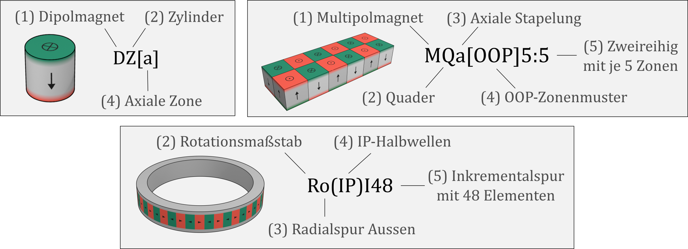
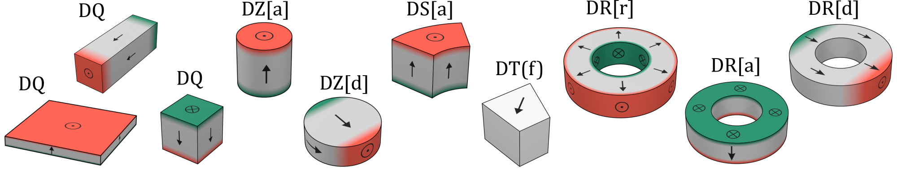
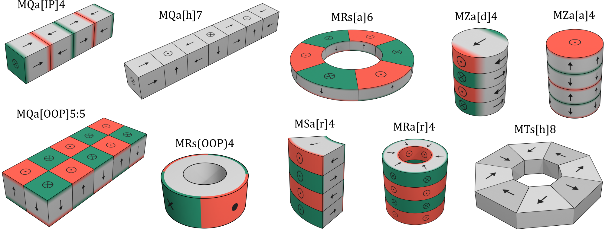
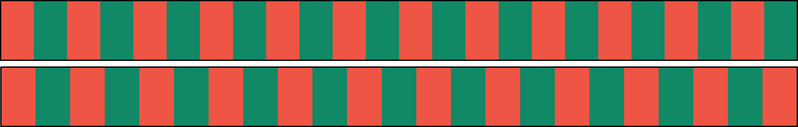
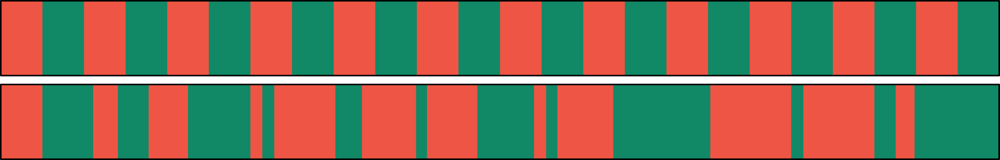
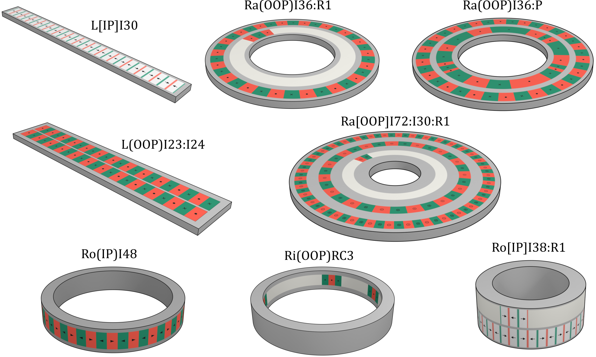
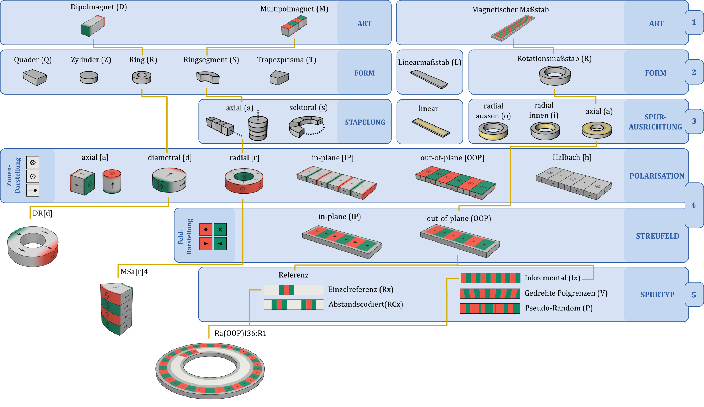

# Einteilung magnetischer Maßverkörperungen {#sec-07}

Dieses Kapitel führt eine systematische Einteilung magnetischer Maßverkörperungen nach struktureller Komplexität, geometrischer Anordnung und magnetischer Ausprägung ein. Sie erfasst typische praxisrelevante Ausführungsformen, ohne Anspruch auf Vollständigkeit, und unterstützt eine einheitliche Bezeichnung. Es handelt sich um eine Weiterentwicklung der in DIN SPEC 91411 [@DIN91411] vorgeschlagenen Einteilung.

## Grundlegende Einteilung und Kurznotation {#sec-07-grundlegende-einteilung}

Die Einteilung magnetischer Maßverkörperungen erfolgt auf mehreren Beschreibungsebenen. Auf der **ersten Ebene** werden sie anhand ihrer strukturellen Komplexität in drei **Arten** eingeteilt: Dipolmagnete, Multipolmagnete und magnetische Maßstäbe.

Auf der **zweiten Ebene** wird die geometrische **Form** der Maßverkörperung beschrieben. Hierzu werden die Begrenzungsbox-Geometrien nach @sec-04-darstellungskonventionen verwendet.

Auf der **dritten Ebene** wird die geometrische **Anordnung** der magnetischen Struktur beschrieben. Bei magnetischen Maßstäben entspricht diese der Spurausrichtung, bei Multipolmagneten der Stapelung ihrer Zonen.

Auf der **vierten Ebene** wird die **magnetische Ausprägung** der Maßverkörperung beschrieben. Zonenbezogen erfolgt dies über Zonenmuster, beispielsweise über die Polarisationsrichtung eines Dipolmagneten oder die Polarisationsart einer Spur. Feldbezogen erfolgt die Beschreibung über Polmuster oder die Ausprägung der Halbwellen.

Auf der **fünften Ebene** wird die Beschreibung weiter spezifiziert und **quantifiziert**. Bei Multipolmagneten wird beispielsweise die Anzahl der gestapelten Zonen angegeben. Bei magnetischen Maßstäben können Spurtypen sowie die Anzahl der Zonen, Pole, Halbwellen oder Referenzlagen angegeben werden.

Zur kompakten Kennzeichnung wird eine **Kurznotation** eingeführt. Sie fasst die wesentlichen Merkmale in der Reihenfolge der Einteilungsebenen zusammen. Zunächst werden die Angaben zu Art, Form und geometrischer Anordnung aufgeführt. Anschließend wird die magnetische Ausprägung angegeben, bei zonenbezogener Beschreibung in eckigen Klammern und bei feldbezogener Beschreibung in runden Klammern. Abschließend werden weiterführende Spezifikation und Quantifizierung angehängt. Sind innerhalb einer Einteilungsebene mehrere Angaben erforderlich, beispielsweise bei mehreren Spuren, werden diese durch einen Doppelpunkt getrennt. Beispiele für die Kurznotation sind in @fig-sec07-01-kurznotation gezeigt.

{#fig-sec07-01-kurznotation width=80% fig-pos="h"}

Die Einteilung in fünf Ebenen bezieht sich auf die **Repräsentation einer Maßverkörperung**. Insbesondere auf der vierten Ebene kann dieselbe Maßverkörperung je nach Zweck zonenbezogen über ein Zonenmuster oder feldbezogen über ein Polmuster beziehungsweise die Ausprägung der Halbwellen beschrieben werden. Beispielsweise können Ra[OOP]48 und Ra(iP)48 dieselbe Maßverkörperung einmal in zonenbezogener und einmal in feldbezogener Repräsentation bezeichnen.

Das Einteilungssystem ist in der **Taxonomie magnetischer Maßverkörperungen** in @fig-sec07-14-taxonomie übersichtlich dargestellt. Die folgenden Unterkapitel beschreiben die Einteilungsebenen für jede der drei Hauptgruppen im Detail.

## Dipolmagnete {#sec-07-dipolmagnete}

**Dipolmagnete** (D) sind magnetische Maßverkörperungen, deren Polarisation durch eine einzelne magnetisierte Zone beschrieben werden kann. Im Außenraum wird das Magnetfeld typischerweise durch den Dipolanteil dominiert. Sie stellen damit hinsichtlich ihrer magnetischen Struktur die einfachste Art dar.

Auf der **zweiten Einteilungsebene** werden Dipolmagnete anhand ihrer geometrischen **Form** unterschieden. Die gängigste Ausführung ist der Quader (Q). Abhängig vom Verhältnis seiner Kantenlängen werden quaderförmige Magnete häufig auch als Würfel-, Platten- oder Stabmagnete bezeichnet. Weitere verbreitete Formen sind Zylinder (Z), Ringe (R), Ringsegmente (S) und Trapezprismen (T). Trapezprismen werden insbesondere als Einzelmagnete zum Aufbau zusammengesetzter magnetischer Strukturen, beispielsweise von Halbach-Anordnungen, eingesetzt.

Die **dritte** und die **fünfte Einteilungsebene** entfallen bei Dipolmagneten, da sie nur aus einer einzelnen Zone bestehen.

Die magnetische Ausprägung auf der **vierten Einteilungsebene** wird durch die **Polarisationsrichtung** beschrieben. Quaderförmige Dipolmagnete sind typischerweise entlang einer ihrer Hauptachsen polarisiert. Bei Zylindern und Ringen werden insbesondere axiale (a), diametrale (d) und radiale (r) Polarisation unterschieden. Axiale Polarisation verläuft parallel zur Zylinderachse, diametrale Polarisation senkrecht dazu und radiale Polarisation in radialer Richtung. Freie Polarisationsrichtungen (f) werden angegeben, wenn die Polarisation keiner der definierten Standardrichtungen entspricht.

@fig-sec07-02-dipolmagnete zeigt typische Beispiele der hier beschriebenen Ausführungen in farbcodierter Zonendarstellung.

{#fig-sec07-02-dipolmagnete width=100% fig-pos="h"}

## Multipolmagnete {#sec-07-multipolmagnete}

**Multipolmagnete** (M) sind magnetische Maßverkörperungen, die aus mehreren Zonen bestehen. Im Unterschied zu magnetischen Maßstäben ist ihre magnetische Struktur weniger komplex und nicht in magnetische Spuren gegliedert.

Auf der **zweiten Einteilungsebene** wird ihre geometrische **Form** beschrieben. Analog zu Dipolmagneten werden insbesondere Quader (Q), Zylinder (Z), Ringe (R) und Ringsegmente (S) unterschieden. Entspricht die Form der Maßverkörperung wegen komplexer Zusammensetzung keiner der hier beschriebenen Formen, kann man sich auch auf die Zonenform beziehen, siehe MTs[h]8 in @fig-sec07-03-multipolmagnete.

Auf der **dritten Einteilungsebene** wird die geometrische **Anordnung** der Zonen beschrieben. Die Zonen können geradlinig beziehungsweise axial (a) oder sektoral beziehungsweise kreisförmig (s) gestapelt sein. Darüber hinaus wird zwischen einreihigen und mehrreihigen Anordnungen unterschieden. Die Zonenform der Maßverkörperung ergibt sich aus ihrer geometrischen Form und der Stapelung.

Die **magnetische Ausprägung** von Multipolmagneten auf der **vierten Einteilungsebene** ist typischerweise durch das Zonenmuster oder das Polmuster gegeben. Bei quaderförmigen und sektoral gestapelten Anordnungen wird zwischen out-of-plane (OOP), in-plane (IP) und Halbach-Anordnungen (h) unterschieden. Bei rotationssymmetrischen Formen werden analog zu Dipolmagneten axiale (a), diametrale (d) und radiale (r) Polarisationsrichtungen unterschieden. Die Polarisation benachbarter Zonen ist dabei alternierend ausgerichtet. Zonen- und Polmuster, die keiner dieser Klassen zugeordnet werden können, werden als frei (f) gekennzeichnet.

Auf der **fünften Einteilungsebene** wird die Struktur durch die **Anzahl der Zonen** oder Pole weiter spezifiziert. Bei mehrreihigen Anordnungen wird sie für jede Reihe getrennt angegeben.

@fig-sec07-03-multipolmagnete zeigt typische Beispiele der hier beschriebenen Ausführungen.

{#fig-sec07-03-multipolmagnete width=100%  fig-pos="h"}

## Magnetische Maßstäbe {#sec-07-massstaebe}

**Magnetische Maßstäbe** sind Maßverkörperungen mit komplexer magnetischer Struktur, die in eine oder mehrere magnetische Spuren gegliedert ist. Auf **zweiter Ebene** unterscheidet man Linearmaßstäbe (L) und Rotationsmaßstäbe (R). Auf **dritter Ebene** werden Rotationsmaßstäbe in Maßstäbe mit innenliegender Radialspuren (i), außenliegender Radialspuren (o) und Axialspuren (a) eingeteilt.

Die Beschreibung der **magnetischen Ausprägung** auf der **vierten Einteilungsebene** kann zonen- oder feldbezogen erfolgen. Typische Zonenmuster sind in-plane (IP), out-of-plane (OOP) und Halbach-Anordnungen (h). Feldbezogen erfolgt die Beschreibung über das Polmuster oder über die Halbwellen einer ausgewählten Komponente des Streufeldes. Dabei werden in-plane- (IP) und out-of-plane-Komponenten (OOP) unterschieden.

Auf der **fünften Einteilungsebene** wird die magnetische Struktur durch den **Spurtyp** sowie gegebenenfalls eine zugehörige Kenngröße gekennzeichnet, die die **Anzahl** der Elemente oder Referenzlagen angibt. Bei mehrspurigen Maßstäben werden die Angaben für die einzelnen Spuren durch Doppelpunkte getrennt angegeben.

Die **Spurtypen** beschreiben die magnetische Strukturierung einer Spur und dienen ihrer funktionalen Unterscheidung. Ein Spurtyp kann durch unterschiedliche Zonenmuster, beispielsweise IP, OOP oder Halbach, realisiert und sowohl zonen- als auch feldbezogen beschrieben werden. In den nachfolgend dargestellten schematischen Mustern werden Zonen, Pole und Halbwellen abstrahierend als Elemente bezeichnet; Richtungssymbole werden nicht verwendet. Im Zweifelsfall beziehen sich die dargestellten Elemente auf Halbwellen.

**Inkrementalspuren** (I$x$) bestehen aus $x$ alternierenden Elementen gleicher Länge. Das daraus resultierende periodische Spurfeld ermöglicht die Erfassung relativer Lage-, Winkel- oder Geschwindigkeitsänderungen mit hoher Ortsauflösung. Ein Beispiel ist in @fig-sec07-04-inkremental gezeigt.

{#fig-sec07-04-inkremental width=70% fig-pos="H"}

**Referenzspuren** (R$x$) kennzeichnen $x$ definierte Referenzlagen, beispielsweise Start- oder Endlagen. Eine Referenz wird typischerweise nicht durch ein einzelnes Element, sondern durch eine charakteristische Kombination mehrerer Elemente gebildet. Ein Beispiel ist in @fig-sec07-05-referenz gezeigt. 

{#fig-sec07-05-referenz width=70% fig-pos="H"}

Eine Sonderform bilden **abstandscodierte Referenzspuren** (RC$x$) mit $x$ Referenzlagen. Die Lage wird dabei aus dem Abstand zwischen aufeinanderfolgenden Referenzen bestimmt. Ein Beispiel ist in @fig-sec07-06-referenz2 gezeigt.

{#fig-sec07-06-referenz2 width=70% fig-pos="H"}

Für bestimmte Anwendungen können Spuren mit variablen Elementlängen eingesetzt werden. Ein wichtiger Vertreter ist der **Pseudorandomcode** (P), auch als pseudo-random binary sequence bezeichnet. Dabei handelt es sich um eine Codierung, aus der mit geeigneter Sensorik die absolute Lage bestimmt werden kann. Ein Beispiel ist in @fig-sec07-07-pseudorandom gezeigt.

{#fig-sec07-07-pseudorandom width=70% fig-pos="H"}

Die Bestimmung der Absolutlage ist auch mit **gedrehten Elementgrenzen** (V) möglich. Ein Beispiel ist in @fig-sec07-08-gedreht gezeigt.

{#fig-sec07-08-gedreht width=70%  fig-pos="H"}

**Kombinationen mehrerer parallel verlaufender Spuren** eröffnen weitere Anwendungsmöglichkeiten. Beispielsweise kann eine Inkrementalspur mit einer Referenzspur kombiniert werden, um einen definierten Bezugspunkt für die Zählung der Inkremente festzulegen. Nach dem Anfahren der Referenzlage kann daraus eine absolute Lage mit der hohen Genauigkeit der Inkrementalspur bestimmt werden. Ein Beispiel ist in @fig-sec07-09-incremental-referenz gezeigt.

{#fig-sec07-09-incremental-referenz width=70%  fig-pos="H"}

Auch bei der Kombination einer Inkrementalspur mit einer abstandscodierten Referenzspur kann eine absolute Lage bestimmt werden. Dies ist gegenüber der Kombination mit einfacher Referenzspur bereits nach kürzerer Relativbewegung möglich. Ein entsprechendes Beispiel ist in @fig-sec07-10-inkremental-referenz2 gezeigt.

{#fig-sec07-10-inkremental-referenz2 width=70%  fig-pos="H"}

Wenn zwei Inkrementalspuren nebeneinander angeordnet sind und sich ihre Elementanzahlen in einem definierten Verhältnis unterscheiden, kann aus dem Phasenbezug zwischen den beiden Spuren die Absolutlage bestimmt werden. Die Kombination wird häufig als **Noniusmuster** bezeichnet. Ein Beispiel ist in @fig-sec07-11-nonius gezeigt.

{#fig-sec07-11-nonius width=70%  fig-pos="H"}

Mit einem Pseudorandomcode kann die absolute Lage direkt bestimmt werden. Die erreichbare Auflösung ist jedoch begrenzt. Durch die Kombination mit einer Inkrementalspur können Messauflösung und -genauigkeit erhöht werden. Dabei liefert die Pseudorandomcode-Spur die absolute Lage, während die Inkrementalspur zur höher aufgelösten Feinbestimmung und gegebenenfalls zur Korrektur verwendet wird. Ein Beispiel ist in @fig-sec07-12-inkremental_pseudo gezeigt.

{#fig-sec07-12-inkremental_pseudo width=70% fig-pos="H"}

Die nachfolgende @fig-sec07-13-massstabe zeigt Beispiele typischer magnetischer Maßstäbe mit der jeweils zugehörigen Kurznotation.

{#fig-sec07-13-massstabe width=100% fig-pos="h"}

```{=latex}
\clearpage
\begin{landscape}
```

## Taxonomie magnetischer Maßverkörperungen {#sec-07-taxonomie}

{#fig-sec07-14-taxonomie width=100% fig-pos="H"}

```{=latex}
\end{landscape}
\clearpage
```