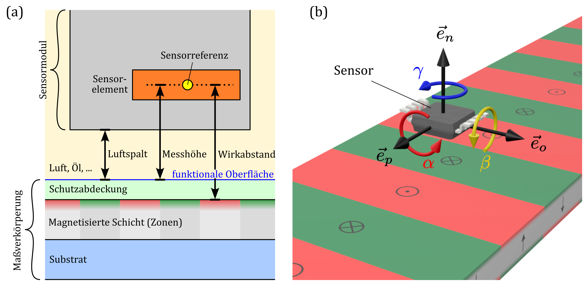

# Schnittstelle zur Sensorik {#sec-08}

Der Sensor erfasst das von der Maßverkörperung erzeugte Streufeld und bildet damit die Schnittstelle zwischen Maßverkörperung und Messsystem. Seine konkrete technologische Ausführung ist nicht Gegenstand dieser Richtlinie. Im Folgenden werden jedoch die für die Beschreibung magnetischer Messsysteme erforderlichen sensorbezogenen Begriffe zum Aufbau des Sensormoduls, zur Erfassung des Streufeldes sowie zur Lagebeziehung zwischen Sensor und Maßverkörperung eingeführt.

## Sensorart und -funktion {#sec-08-sensorart_funktion}

Magnetische Sensoren können nach der **Art der ausgegebenen Messgröße** unterschieden werden. Ein **Magnetfeldsensor** dient dazu, den Wert einer oder mehrerer Komponenten des Magnetfeldvektors ortsbezogen zu erfassen und als feldbezogene Ausgangsgröße bereitzustellen. Ein **magnetischer Positions- oder Winkelsensor** erfasst ebenfalls das Magnetfeld, verarbeitet dieses jedoch intern weiter und gibt als Ausgangsgröße unmittelbar eine Positions- oder Winkelinformation aus. Während der Magnetfeldsensor somit eine feldbezogene Messgröße liefert, stellt der magnetische Positions- oder Winkelsensor bereits eine anwendungsbezogene Ausgangsgröße bereit.

Unabhängig von der Art der Ausgangsgröße können Sensoren nach ihrer **Funktion** im jeweiligen Anwendungs- oder Prüfkontext unterschieden werden. Ein **Prüfsensor** bezeichnet dabei keine eigene Sensorart, sondern die Funktion eines Sensors, der zu Prüf-, Einstell- oder Charakterisierungszwecken eingesetzt wird; hierbei handelt es sich in der Regel um einen Magnetfeldsensor. Ein **Referenzsensor** dient der Bereitstellung eines Vergleichs- oder Bezugswertes. Ein **Betriebssensor** ist der im regulären Betrieb des Systems eingesetzte Sensor, dessen Ausgangssignal für die vorgesehene Funktion des Systems genutzt wird.

## Aufbau des Sensormoduls {#sec-08-aufbau_sensormodul}

Ein **Sensormodul** ist eine funktionale Einheit zur Erfassung und Verarbeitung magnetischer Messgrößen. Es umfasst ein oder mehrere magnetisch sensitive Sensorelemente sowie gegebenenfalls weitere Komponenten für Versorgung, Signalaufbereitung, Datenverarbeitung und elektrische Anbindung.

Das **Sensorelement** bezeichnet das eigentliche Wandlerelement, das eine magnetische Messgröße erfasst und in eine elektrische Größe umwandelt. In einem Sensormodul können mehrere Sensorelemente räumlich unterschiedlich angeordnet sein und unterschiedliche Komponenten des Magnetfeldes erfassen.

Bei Sensoren in Halbleitertechnik sind ein oder mehrere Sensorelemente typischerweise auf einem **Sensorchip** integriert. Der Sensorchip kann zusammen mit elektrischen Kontaktierungen und weiteren Bauelementen in einem **Package** zusammengefasst sein. Das Package schützt den Chip und stellt insbesondere die mechanische und elektrische Schnittstelle zur weiteren Integration bereit.

Ein Package kann unmittelbar das äußere **Sensorgehäuse** bilden oder zusammen mit weiteren Komponenten in ein separates Sensorgehäuse integriert sein. Das vollständige Sensormodul kann darüber hinaus beispielsweise eine **Leiterplatte**, zusätzliche elektronische Bauelemente, Steckverbinder und mechanische Befestigungselemente umfassen.

Die genannten Integrationsebenen sind nicht bei allen Sensoren getrennt ausgeführt und stellen keine zwingende Aufbauhierarchie dar. Die Begriffe dienen der eindeutigen Bezeichnung der jeweils betrachteten funktionalen beziehungsweise konstruktiven Ebene.

![Beispielhafter Aufbau eines Sensormoduls[^fig-sensormodul_aufbau]](figures/sec08/01-sensormodul_aufbau.png){#fig-sec08-01-sensormodul_aufbau width=100%}

[^fig-sensormodul_aufbau]: Quelle der Abbildungen: Infineon AG, Augustin Group GmbH und mit freundlicher Genehmigung von U. Ausserlechner; redaktionelle Aufbereitung durch Autoren.

@fig-sec08-01-sensormodul_aufbau zeigt beispielhaft den Aufbau eines Sensormoduls in Halbleitertechnik und veranschaulicht die Integrationsebenen vom Sensorelement über Sensorchip, Package und Sensorgehäuse bis zum Sensormodul.

## Lagebeziehung des Sensors {#sec-08-lagebeziehung-sensor}

Die in @sec-05-ermittlungsbereich_und_feldverläufe eingeführten Ermittlungsbereiche beschreiben die räumlichen Bereiche, in denen das Streufeld betrachtet beziehungsweise vermessen wird. In einem realen Messaufbau werden sie durch eine entsprechende Lagebeziehung zwischen Sensor und Maßverkörperung realisiert. In diesem Unterkapitel wird die hierfür erforderliche Terminologie eingeführt.

Als **Sensorreferenz** $O_S$ wird ein zweckmäßiger Bezugspunkt für die Sensorelemente festgelegt. Er sollte die Lage der Sensorelemente möglichst repräsentativ beschreiben, beispielsweise in der geometrischen Mitte der Sensorelemente beziehungsweise des von ihnen eingenommenen sensitiven Bereichs. Mit der Sensorreferenz als Ursprung wird ein rechtshändiges **Sensor-KS** mit den Koordinatenrichtungen $x$, $y$ und $z$ definiert.

In diesem Bezugssystem werden Lage und geometrische Ausdehnung der Sensorelemente beschrieben. Das ermöglicht eine einheitliche geometrische Beschreibung der Sensorelemente, deren Ausführung stark von der eingesetzten Sensortechnologie abhängen kann.

Bei **nominaler Ausrichtung** des Sensors verlaufen die $x$-, $y$- und $z$-Richtung parallel zur lokalen $p$-, $o$- beziehungsweise $n$-Richtung des Maßverkörperungs-KS.

Die **Sensorlage** $\vec{r}_S$ bezeichnet die Lage der Sensorreferenz im Maßverkörperungs-KS. Sie wird durch die Koordinaten $p_S$, $o_S$ und $n_S$ beschrieben. Durch die Relativbewegung von Sensor und Maßverkörperung werden unter Berücksichtigung von Lage und geometrischer Ausdehnung der Sensorelemente die entsprechenden Ermittlungsbereiche erfasst.

Zur Beschreibung des **Abstands zwischen Sensor und Maßverkörperung** wird aufgrund des oft mehrschichtigen Aufbaus von Sensormodul und Maßverkörperung zwischen Luftspalt, Wirkabstand und Messhöhe unterschieden.

Der **Luftspalt** $d_\mathrm{mech}$ bezeichnet den freien mechanischen Abstand zwischen den einander zugewandten Oberflächen von Maßverkörperung und Sensorgehäuse. Er beschreibt damit eine konstruktive Größe des Messsystems.

Der **Wirkabstand** $d_\mathrm{mag}$ bezeichnet den Abstand in lokaler $n$-Richtung zwischen der sensorzugewandten Begrenzung der Zonenstruktur und der Sensorreferenz. Im Gegensatz zum Luftspalt beschreibt er die Distanz zwischen der Oberseite der magnetisch wirksamen Struktur und den Sensorelementen, unabhängig von dazwischenliegenden magnetisch inaktiven Elementen wie Schutzabdeckungen und Packages.

Die **Messhöhe** $n$ bezeichnet die $n$-Koordinate im Maßverkörperungs-KS und damit den Abstand von der funktionalen Oberfläche. Die Messhöhe der Sensorreferenz entspricht dem Wirkabstand,

wenn die Begrenzung der Zonenstruktur mit der funktionalen Oberfläche zusammenfällt, was beispielsweise bei Maßverkörperungen mit Schutzabdeckungen nicht gegeben ist.

Die **Sensororientierung** bezeichnet die Orientierung des Sensor-KS relativ zum lokalen Maßverkörperungs-KS an der Sensorlage. Bei nominaler Ausrichtung stimmen die entsprechenden Koordinatenrichtungen beider Koordinatensysteme überein.

Abweichungen von der nominalen Ausrichtung werden durch die **Sensordrehwinkel** $\alpha$ (Rotation um $\vec{e}_p$), $\beta$ (Rotation um $\vec{e}_o$) und $\gamma$ (Rotation um $\vec{e}_n$) beschrieben. Drehungen mit $\alpha$ und $\beta$ führen zu einer Verkippung des Sensors gegenüber der funktionalen Oberfläche, während eine Drehung mit $\gamma$ einer Verdrehung innerhalb der zur funktionalen Oberfläche parallelen Ebene entspricht. Treten mehrere endliche Sensordrehwinkel gleichzeitig auf, ist die verwendete Reihenfolge der Drehungen anzugeben.

{#fig-sec08-02-sensor_lage width=100%}

@fig-sec08-02-sensor_lage veranschaulicht die Lagebeziehung zwischen Sensor und Maßverkörperung. Teilbild (a) zeigt die Größen Luftspalt, Wirkabstand und auf die Sensorreferenz bezogene Messhöhe. Teilbild (b) zeigt die Sensordrehwinkel.

| Begriff | Symbol | Beschreibung |
|:--------|:------:|:-------------|
| **Sensorlage** | $\vec{r}_S$ | Lage der Sensorreferenz im Maßverkörperungs-KS |
| **Luftspalt** | $d_\mathrm{mech}$ | Freier mechanischer Abstand zwischen Sensorgehäuse und Maßverkörperung |
| **Wirkabstand** | $d_\mathrm{mag}$ | Abstand zwischen der Oberseite der Zonenstruktur und der Sensorreferenz |
| **Messhöhe** | $n$ | $n$-Koordinate im Maßverkörperungs-KS; Abstand von der funktionalen Oberfläche |
| **Sensordrehwinkel** | $\alpha, \beta, \gamma$ | Drehwinkel zur Beschreibung der Orientierung des Sensors gegenüber der nominalen Ausrichtung |

: Begriffe Sensorlage {.zebra_blue #tbl-begriffe-sensorlage tbl-colwidths="[20,15,55]"}
